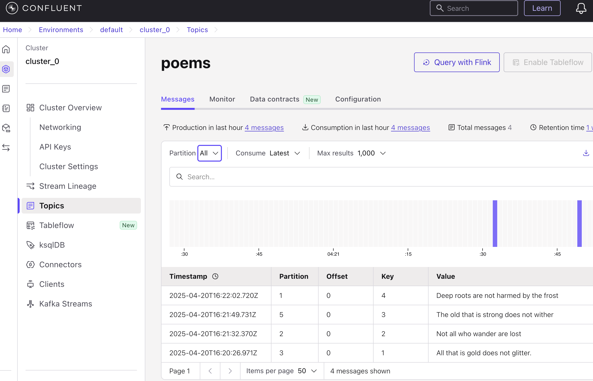
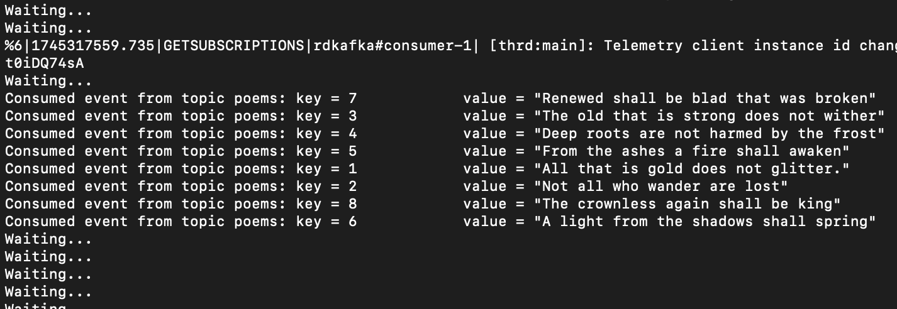
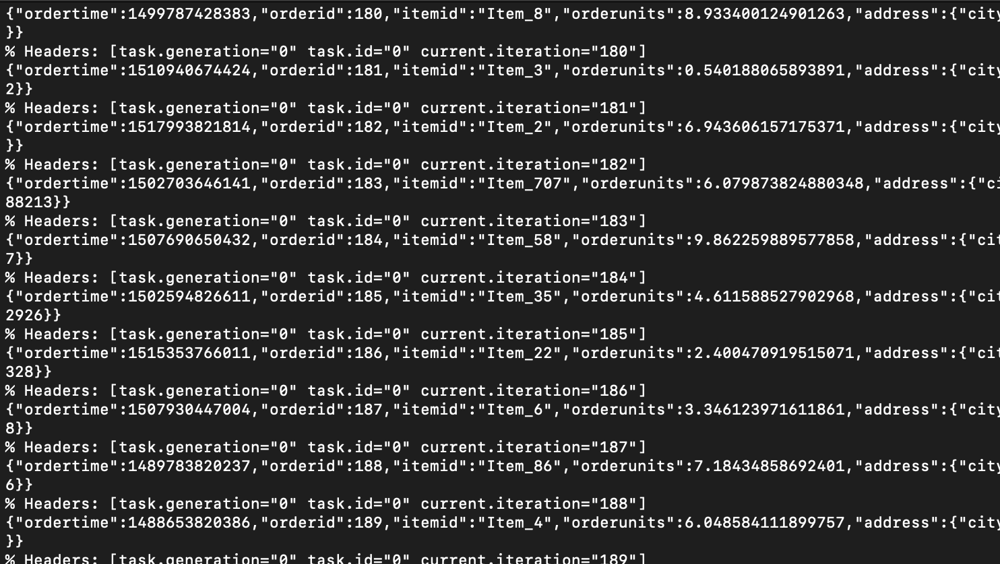
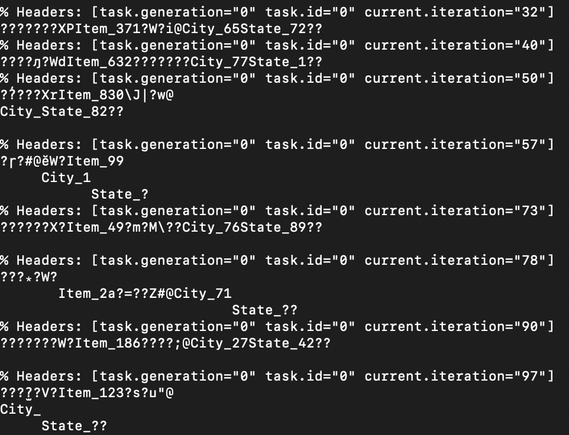
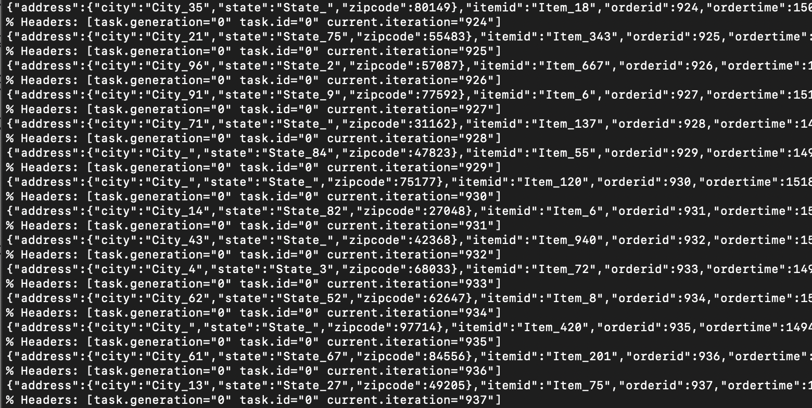

# Getting started

Here I documented the practical things that I have done in the below course<br/>
[Apache Kafka® 101](https://developer.confluent.io/courses/apache-kafka/events/)

# Set up Confluent Cloud

- Head over to the Confluent Cloud signup pageand sign up for a new account
- Enter the details and Click the Start Free button
- Verify email address & create password
- In the welcome screen enter the basic details and click 'Next'

# Create your first cluster!

- In this we will create out first cluster. Clusters hold your data and enable you to process and analyze streaming data in real-time.
- In the 'Create your first cluster' window, choose 'Advanced settings'
- Choose the 'Basic'(For learning and exploring Kafka and Confluent Cloud) cluster and click 'Begin configuration'
- Choose the cloud provider and the region and click 'continue'
- In the next 'Payment' window, you can use the code provided in the course to delay entering the credit card details for 30 days
- Launch cluster

# Billing/Credits

In general you would have 400$ worth of credits to play around for 30 days. But you could also use the promo codes provided in the courses to add some more credits by navigating to Billing & payment from the settings menu in the upper right. On that screen, go to the Payment details & contacts tab to enter the promo code.

# Create Your First Kafka Topic on Confluent Cloud

Go to the Confluent landing page by clicking on the Confluent icon on the top left corner. Then navigate to the 'Environments' - 'default' and select the cluster you created under 'Live'

- Select the Topics tab on the left-hand side of the screen, then choose Create topic
- Name your topic "poems" The default number of partitions for a topic is six, which works well for today’s use case, so go ahead and select Create with defaults
- Skip the 'Data contract' window as of now
- In the next screen, which displays your topic, select the Messages tab to view the contents of the topic (which is empty at this point). Select Produce a new message (Under 'Actions' on the top right corner): This will open a UI that lets you enter a key and value for a new message (remember that a message, or an event, is a key/value pair)
- Delete the existing data in the key and value fields, and enter "1” for the key. For the value, enter a line from a poem that may sound familiar, such as, "All that is gold does not glitter." Then Click on 'Produce'
- In a similar fashion, add the next few lines of the poem
  - 2, "Not all who wander are lost"
  - 3, "The old that is strong does not wither"
  - 4, "Deep roots are not harmed by the frost"
- The four messages will be distributed amongst the six partitions of the topic



# Set Up the Confluent CLI

Go to the Confluent landing page by clicking on the Confluent icon on the top left corner. Then navigate to the 'Environments' - 'default' and select the cluster you created under 'Live'

- select **CLI and tools** from the lower left-hand corner of the screen. From here, you’ll find instructions on how to download and update the command line tools that we’ll be using.

- Paste the curl command into a terminal to install the CLI.

```bash
curl -L --http1.1 https://cnfl.io/cli | sh -s -- -b /usr/local/bin
```

In the macos I got permission issues like 'Operation not permitted/Permission denied' So I installed like below

```bash
sudo curl -L --http1.1 https://cnfl.io/cli | sh -s -- -b $HOME/.local/bin
```

The above command downloads the Confluent CLI installer script (curl) and nstalls it into a folder you can write to: ~/.local/bin. This avoids permission issues that happen with protected system folders like /usr/local/bin. The -b option tells the installer where to put the confluent command

```bash
export PATH="$HOME/.local/bin:$PATH"
```

The above adds that folder to your terminal's PATH so that your shell can find and run confluent from anywhere

```bash
source ~/.zshrc
```

Reloads your shell config so the PATH change takes effect immediately (no need to restart Terminal). The above will apply the path change only to your current session. You’ll need to make the PATH change persistent by adding it to your ~/.zshrc file properly

Open your shell config file

```bash
nano ~/.zshrc
```

Add this line at the bottom and Save and exit nano (Control + X / Press Y to confirm / Press Enter to save)

```bash
export PATH="$HOME/.local/bin:$PATH"
```

Reload your config

```bash
source ~/.zshrc
```

- You'll receive the latest version (check it), but note that it is a good idea once in a while to update the CLI with the following

```bash
confluent --version
confluent update
```

- From a terminal, log in to Confluent Cloud with the credentials that you used to create your Confluent Cloud account. (The --save flag saves your login details locally so that you don’t have to reenter your credentials so frequently.)

```bash
confluent login --save
```

- Next, determine your Confluent environment by running

```bash
confluent environment list
```

If your account is new, you should expect to only see one environment. Observe the output from this command, particularly the ID field. Using ID value from the previous step, run:

```bash
confluent environment use {ID}
```

- Similarly, list out all of the Kafka clusters available to you using the following

```bash
confluent kafka cluster list
```

Again, observe the ID that’s output. Then set the Kafka cluster by running:

```bash
confluent kafka cluster use {ID}
```

- In order to communicate with our Kafka cluster, we need to provide an API key and secret for the CLI to use. Using the cluster ID from earlier step, run:

```bash
confluent api-key create --resource {ID}
```

This command will output an API key and secret; save these securely somewhere. To tell the CLI to use the API key, gather the cluster ID along with the API key and execute:

```bash
confluent api-key use {API Key} --resource {ID}
```

Now your CLI is set up and ready to use!

# Produce and Consume Using the Confluent CLI

- From a terminal window, list out all of the topics available to you. You should see the poems topics that we created earlier

```bash
confluent kafka topic list
```

- Consume messages from the poems topic. The --from-beginning flag tells the consumer to start from the earliest known offset on the topic, i.e., the earliest message. Leave this consumer running in the terminal window

```bash
confluent kafka topic consume --from-beginning poems
```

- From another terminal window, begin to produce more messages to the topic. Execute the produce command with the --parse-key flag to automatically read both keys and values separated by the “:” symbol

```bash
confluent kafka topic produce poems --parse-key
```

When prompted, enter the following strings as written:

```
	5:"From the ashes a fire shall awaken"
	6:"A light from the shadows shall spring"
	7:"Renewed shall be blad that was broken"
	8:"The crownless again shall be king"
```

- Observe the messages as they’re being output in the consumer terminal window. Navigate to Confluent Cloud. From the poems topic overview page, select the Messages tab and observe where the new messages have been written

# Partitioning

Partitions are useful in allowing you to break up your topic into manageable chunks that can be stored across multiple nodes in your cluster

- From the terminal window, list your available topics. You should see only the poems topic.

```bash
confluent kafka topic list
```

- Describe the topic to see more details into the topic and its configuration values. In particular, make note of the Partition Count value, which is 6

```bash
confluent kafka topic describe poems
```

- Create two more topics with 1 and 4 partitions, respectively

```bash
confluent kafka topic create --partitions 1 poems_1
confluent kafka topic create --partitions 4 poems_4
```

- Produce data to the topics using the produce command and --parse-key flag

```bash
confluent kafka topic produce poems_1 --parse-key
```

When prompted, enter the following strings as written:

```
	1:”All that is gold does not glitter”
	2:"Not all who wander are lost"
	3:"The old that is strong does not wither"
	4:"Deep roots are not harmed by the frost"
	5:"From the ashes a fire shall awaken"
	6:"A light from the shadows shall spring"
	7:"Renewed shall be blad that was broken"
	8:"The crownless again shall be king"
```

- Repeat the above step for the poems_4 topic

- From the Confluent Cloud Console, view the newly produced messages in both topics. Note that the poems_1 topic has all eight messages in its single partition while the poems_4 topic has a slightly different distribution. This should have given you a good idea of how partitions will affect the distribution of data across your topic.

# Consumers

In practice, programmatically producing and consuming messages is an important way to interact with your Apache Kafka cluster and put data into motion. Earlier we gained experience consuming from and producing to a Kafka topic using the command line. With that experience under your belt, let’s explore a more programmatic way of consuming messages by writing a consumer script in Python.

- From a terminal window, activate a new virtual environment and install the confluent-kafka library.

```bash
pip3 install virtualenv #Install virtualenv if not installed already
virtualenv env # Create a virtual environment named 'env' to isolate dependencies
source env/bin/activate # Activate the virtual environment (Linux/macOS syntax)
pip install confluent-kafka # Install the Confluent Kafka Python client inside the virtual environment
```

- Determine your cluster endpoint by running the below. The output contains an endpoint field; take note of the hostname and port from this value, for example, pkc-abc12.us-central1.gcp.confluent.cloud:9092

```bash
confluent kafka cluster describe
```

- You need an API key and secret in order to proceed. If you have the api key that you created earlier, you can use that. If not you need create a new one. Once you have it, set the key using:

```bash
confluent api-key use {API Key} --resource {ID}
```

- Using your favorite text editor, create a configuration file named **config.ini** and populate it with the following, substituting in your endpoint, key and secret values

```ini
[default]
bootstrap.servers=< Endpoint >
security.protocol=SASL_SSL
sasl.mechanisms=PLAIN
sasl.username=< API Key >
sasl.password=< API Secret >

[consumer]
group.id=python_kafka101_group_1
# 'auto.offset.reset=earliest' to start reading from the beginning of
# the topic if no committed offsets exist.
auto.offset.reset=earliest
```

- Create another file named **consumer.py** that contains the following:

```python
#!/usr/bin/env python
from argparse import ArgumentParser, FileType
from configparser import ConfigParser
from confluent_kafka import Consumer
if __name__ == '__main__':
    # Parse the command line.
    parser = ArgumentParser()
    parser.add_argument('config_file', type=FileType('r'))
    args = parser.parse_args()

    # Parse the configuration.
    config_parser = ConfigParser()
    config_parser.read_file(args.config_file)
    config = dict(config_parser['default'])
    config.update(config_parser['consumer'])

    # Create Consumer instance
    consumer = Consumer(config)

    # Subscribe to topic
    topic = "poems"
    consumer.subscribe([topic])

    # Poll for new messages from Kafka and print them.
    try:
        while True:
            msg = consumer.poll(1.0)
            if msg is None:
                print("Waiting...")
            elif msg.error():
                print("ERROR: %s".format(msg.error()))
            else:
                # Extract the (optional) key and value, and print.
                print("Consumed event from topic {topic}: key = {key:12} value = {value:12}".format(topic=msg.topic(), key=msg.key().decode('utf-8'), value=msg.value().decode('utf-8')))
    except KeyboardInterrupt:
        pass
    finally:
        # Leave group and commit final offsets
        consumer.close()
```

- Make the script executable and run:

```bash
chmod u+x consumer.py
./consumer.py config.ini
```

- Observe the messages being output and stop the consumer script using ctrl+C. This script was deliberately simple, but the steps of configuring your consumer, subscribing to a topic, and polling for events are common across all consumers.



# Kafka Connect

Sometimes you would like the data from other systems to get into Kafka topics, and sometimes you would like data in Kafka topics to get into those systems. As Apache Kafka's integration API, this is exactly what Kafka Connect does. On the one hand, Kafka Connect is an ecosystem of pluggable connectors, and on the other, a client application. As a client application, Connect is a server process that runs on hardware independent of the Kafka brokers themselves. It is scalable and fault-tolerant, meaning you can run not just one single Connect worker but a cluster of Connect workers that share the load of moving data in and out of Kafka from and to external systems. Kafka Connect also abstracts the business of code away from the user and instead requires only JSON configuration to run.<br/><br/>

A Connect worker runs one or more connectors. A connector is a pluggable component that is responsible for interfacing with the external system. A source connector reads data from an external system and produces it to a Kafka topic. A sink connector subscribes to one or more Kafka topics and writes the messages it reads to an external system. Each connector is either a source or a sink connector, but it is worthwhile to remember that the Kafka cluster only sees a producer or a consumer in either case. Everything that is not a broker is a producer or a consumer<br/><br/>

One of the primary advantages of Kafka Connect is its large ecosystem of connectors. Writing the code that moves data to a cloud blob store, or writes to Elasticsearch, or inserts records into a relational database is code that is unlikely to vary from one business to the next. Likewise, reading from a relational database, Salesforce, or a legacy HDFS filesystem is the same operation no matter what sort of application does it. You can definitely write this code, but spending your time doing that doesn’t add any kind of unique value to your customers or make your business more uniquely competitive<br/><br/>

In the below exercise, we’ll gain experience with Kafka Connect and create a source connector in Confluent Cloud, which will produce data to Apache Kafka. Then, we’ll consume this data from the command line.

- Go to the Confluent landing page by clicking on the Confluent icon on the top left corner. Then navigate to the 'Environments' - 'default' and select the cluster you created under 'Live'

- Select the Connectors tab on the left-hand side of the screen, then in the “Search connectors” search bar, enter “Datagen” to narrow down the available connectors. Select **Sample Data** Datagen Source.

- In the **Launch Sample Data** window, choose 'Additional configuration' from the bottom left corner. Click **Add new topic** and enter 'orders' as Topic name and then click 'Create with defaults'. Once created choose this topic for 'Choose the topics you want to send data to'. In the next 'Create or select an API key' window, choose 'Use an existing API key' and enter the API key and secret we created earlier and click Continue. Select 'JSON' for 'Select output record value format' and 'Orders' for 'Select a schema' and click Continue. Keep the rest as defaults and continue until you launch the connector.

- Once the connector is running, from a terminal window, consume messages from the inventory topic.

```bash
confluent kafka topic consume --from-beginning orders
```



- After testing, choose the connector and go to the 'settings' tab and click 'Delete connector' to avoid losing your credits

# Confluent Schema Registry

Once applications are busily producing messages to Apache Kafka and consuming messages from it, two things will happen. First, new consumers of existing topics will emerge. These are brand new applications—perhaps written by the team that wrote the original producer of the messages, perhaps by another team—and will need to understand the format of the messages in the topic. Second, the format of those messages will evolve as the business evolves. Order objects gain a new status field, usernames split into first and last name from full name, and so on. The schema of our domain objects is a constantly moving target, and we must have a way of agreeing on the schema of messages in any given topic. **Confluent Schema Registry exists to solve this problem.** <br/><br/>

Schema Registry is a standalone server process that runs on a machine external to the Kafka brokers. Its job is to maintain a database of all of the schemas that have been written into topics in the cluster for which it is responsible. That “database” is persisted in an internal Kafka topic and cached in Schema Registry for low-latency access. Schema Registry can be run in a redundant, high-availability configuration, so it remains up if one instance fails <br/><br/>

Schema Registry is also an API that allows producers and consumers to predict whether the message they are about to produce or consume is compatible with previous versions. When a producer is configured to use Schema Registry, it calls an API at the Schema Registry REST endpoint and presents the schema of the new message. If it is the same as the last message produced, then the produce may succeed. If it is different from the last message but matches the compatibility rules defined for the topic, the produce may still succeed. But if it is different in a way that violates the compatibility rules, the produce will fail in a way that the application code can detect.<br/><br/>

Likewise on the consume side, if a consumer reads a message that has an incompatible schema from the version the consumer code expects, Schema Registry will tell it not to consume the message. Schema Registry doesn’t fully automate the problem of schema evolution—that is a challenge in any system regardless of the tooling—but it does make a difficult problem much easier by preventing runtime failures when possible.

In this hands-on exercise, we'll work through a similar workflow as the previous one, this time seeing how we can write and serialize the data using Avro and leverage Schema Registry to manage our schemas.

- From the Confluent Cloud Console of the cluster we created, select 'Schema Registry' from the lower left-hand corner
- Under the 'Overview' section, select 'API Keys' and create a key for schema registry
- Similar to the earlier hands-on execise, create Sample Data (Datagen Source) connector. Choose a existing topic to produce data into or create a new topic. This time choose 'Avro' format. Keep the rest as default values and start the connector
- With the connector running, navigate to the Schema Registry page to have a look at the Avro schema that has been set for the orders topic. Under Schema Registry - Data Contracts - 'order-value'
- From there, select the orders-value schema and view its fields
- From a terminal window, consume messages from the orders topic. If you’re curious, start by using the same consume command as in the previous exercise. You might have noticed that the data is more or less gibberish with a few recognizable strings. Because the data is serialized to the topic using Avro, before we can read it, the consumer needs to deserialize it. What we’re seeing here is Avro data that is read as if it’s just a regular string

```bash
confluent kafka topic consume --from-beginning orders
```



- To do this the right way, tell the consumer to fetch the Avro schema for this topic from Schema Registry and deserialize the data first. You’ll see the deserialized data being output


