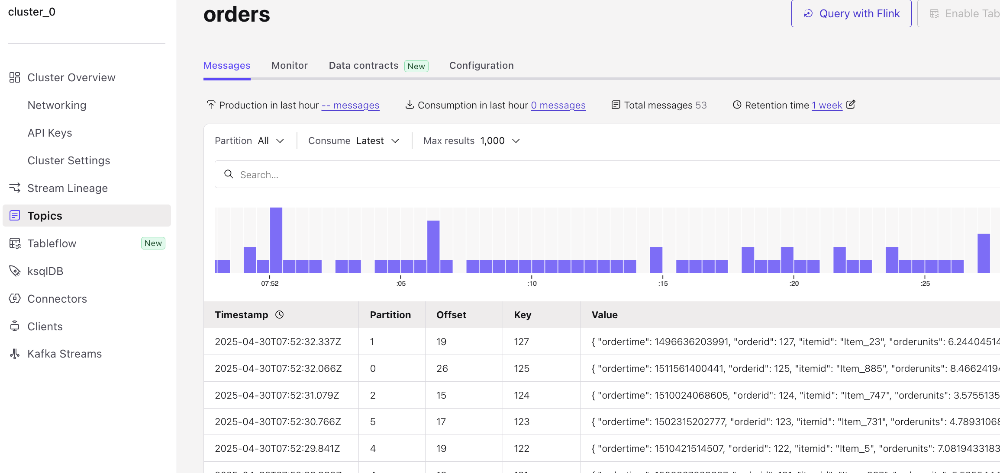

# Getting started

Here I documented the practical things that I have done in the below course 
[Kafka Connect 101](https://developer.confluent.io/courses/kafka-connect/intro/)

# Introduction

## Ingest Data from Upstream Systems

- Kafka Connect is a component of Apache Kafka® that’s used to perform streaming integration between Kafka and other systems such as databases, cloud services, search indexes, file systems, and key-value stores

- Kafka Connect makes it easy to stream data from numerous sources into Kafka, and stream data out of Kafka to numerous targets. The diagram you see here shows a small sample of these sources and sinks (targets). There are literally hundreds of different connectors available for Kafka Connect

## Confluent Cloud Managed Connectors

You can choose to run Kafka Connect yourself or take advantage of the numerous fully managed connectors provided in Confluent Cloud for a totally cloud-based integration solution. In addition to managed connectors, Confluent provides fully managed Apache Kafka, Schema Registry, and stream processing with ksqlDB

## How Kafka Connect Works

- Kafka Connect runs in its own process, separate from the Kafka brokers. It is distributed, scalable, and fault tolerant, giving you the same features you know and love about Kafka itself

- But the best part of Kafka Connect is that using it requires no programming. It’s completely configuration-based, making it available to a wide range of users—not just developers. In addition to ingest and egress of data, Kafka Connect can also perform lightweight transformations on the data as it passes through

- Anytime you are looking to stream data into Kafka from another system, or stream data from Kafka to elsewhere, Kafka Connect should be the first thing that comes to mind. Let’s take a look at a few common use cases where Kafka Connect is used

### Streaming Pipelines

Kafka Connect can be used to ingest real-time streams of events from a data source and stream them to a target system for analytics. In this particular example, our data source is a transactional database.   

We have a Kafka connector polling the database for updates and translating the information into real-time events that it produces to Kafka. That in and of itself is great, but there are several other useful things that we get by adding Kafka to the mix:

- First of all, having Kafka sits between the source and target systems means that we’re building a loosely coupled system. In other words, it’s relatively easy for us to change the source or target without impacting the other.
- Additionally, Kafka acts as a buffer for the data, applying back pressure as needed.
- And also, since we’re using Kafka, we know that the system as a whole is scalable and fault tolerant.

Because Kafka stores data up to a configurable time interval per data entity (topic), it’s possible to stream the same original data to multiple downstream targets. This means that you only need to move data into Kafka once while allowing it to be consumed by a number of different downstream technologies for a variety of business requirements or even to make the same data available to different areas of a business.

### Writing to Datastores from Kafka

- As another use case, you may want to write data created by an application to a target system. This of course could be a number of different application use cases, but suppose that we have an application producing a series of logging events, and we’d like those events to also be written to a document store or persisted to a relational database

- Imagine that you added this logic to your application directly. You’d have to write a decent amount of boilerplate code to make this happen, and whatever code you do add to your application to achieve this will have nothing to do with the application’s business logic. Plus, you’d have to maintain this extra code, determine how to scale it along with your application, how to handle failures, restarts, etc

- Instead, you could add a few simple lines of code to produce the data straight to Kafka and allow Kafka Connect to handle the rest. As we saw in the last example, by moving the data to Kafka, we’re free to set up Kafka connectors to move the data to whatever downstream datastore that we need, and it’s fully decoupled from the application itself

### Evolve Processing from Old Systems to New

By utilizing change data capture (CDC), it’s possible to extract every INSERT, UPDATE, and even DELETE from a database into a stream of events in Kafka. And we can do this in near-real time. Using underlying database transaction logs and lightweight queries, CDC has a very low impact on the source database, meaning that the existing application can continue to run without any changes, all the while new applications can be built, driven by the stream of events captured from the underlying database. When the original application records something in the database—for example, an order is accepted—any application subscribed to the stream of events in Kafka will be able to take an action based on the events—for example, a new order fulfillment service.

## Why Not Write Your Own Integrations?

- All of this sounds great, but you’re probably asking, “Why Kafka Connect? Why not write our own integrations?”

- Apache Kafka has its own very capable producer and consumer APIs and client libraries available in many languages, including C/C++, Java, Python, and Go. So it makes sense for you to wonder why you wouldn’t just write your own code to move data from a system and write it to Kafka—doesn’t it make sense to write a quick bit of consumer code to read from a topic and push it to a target system?

- The problem is that if you are going to do this properly, then you need to be able to account for and handle failures, restarts, logging, scaling out and back down again elastically, and also running across multiple nodes. And that’s all before you’ve thought about serialization and data formats. Of course, once you’ve done all of these things, you’ve written something that is probably similar to Kafka Connect, but without the many years of development, testing, production validation, and community that exists around Kafka Connect. Even if you have built a better mousetrap, is all the time that you’ve spent writing that code to solve this problem worth it? Would your effort result in something that significantly differentiates your business from anyone else doing similar integration?

- The bottom line is that integrating external data systems with Kafka is a solved problem. There may be a few edge cases where a bespoke solution is appropriate, but by and large, you’ll find that Kafka Connect will become the first thing you think of when you need to integrate a data system with Kafka.

**Create a cluster in the confluence cloud for the hands on exercises**

Cluster created with a basic configuration

# Hands On: Getting Started with Kafka Connect

## Create a New Topic

- From the cluster overview page go to the 'Topics' in the left navigation bar and then click 'Create Topic'
- Name the topic 'orders' and ensure that the Number of partitions is set to 6 and Click on 'Create with defaults'

## Create a Data Generator with Kafka Connect

In reality, our Kafka topic would probably be populated from an application using the producer API to write messages to it. Here, we’re going to use a data generator that’s available as a connector for Kafka Connect.

- From the cluster overview page go to the 'Connectors' in the left navigation bar and In the search box, enter datagen.
- Select the Sample Data (Datagen Source) connector
- Select 'Orders' template.
- Go to additional configuration and under the Topic selection, choose the exiting topic 'orders'
- Under Kafka credentials, click on Generate API key & download and click continue
- Under Configuration, choose 'JSON' for output record value format and 'Orders' for 'Select a schema' and click continue
- Under Sizing stay with the defaults
- Review and launch the connector now
- From the Topics page of your cluster, select the orders topic and then Messages. You should see a steady stream of new messages arriving

Keep in mind that this Datagen Source Connector is only a jumping off point for your Kafka Connect journey. As a final step, head on over to the Connectors page and take a look at the other connectors. Dont forget to Delete the created connector.

# Running Kafka Connect

## Connectors

When running Kafka Connect, instances of connector plugins provide the integration between external data systems and the Kafka Connect framework. These connector plugins are reusable components that define how source connectors ought to capture data from data sources to a Kafka topic and also how sink connectors should copy data from Kafka topics to be recognized by a target system. By taking care of all of this boilerplate logic for you, the plugins allow you to hit the ground running with Kafka Connect and focus on your data  

There are hundreds of connector plugins available for a variety of data sources and sinks. There are dozens of fully managed connectors available for you to run entirely through Confluent Cloud. Plus, connectors can also be downloaded from Confluent Hub for use with self-managed Kafka Connect.

## Confluent Cloud Managed Connectors

Confluent Cloud offers pre-built, fully managed, Apache Kafka connectors that make it easy to instantly connect to popular data sources and sinks. With a simple UI-based configuration and elastic scaling with no infrastructure to manage, Confluent Cloud connectors make moving data in and out of Kafka an effortless task, giving you more time to focus on application development. 

To start, you simply select the connector and fill in a few configuration details about your source or target system. This can be done using the Confluent Cloud console, the Confluent CLI, or the Confluent Connect API.

From there, Confluent takes care of the rest on your behalf:

- Using the configuration settings you specified, your connector instance is provisioned and run
- The execution of the connector instance is monitored
- Should the connector fail, you’ll have access to troubleshooting to help identify the root cause, correct the issue, and restart the connector and its tasks

All in all, you can relax knowing that all of these tasks are being handled for you. That said, there are a few limitations regarding managed connectors:

- Some self-managed connectors that are available on Confluent Hub for installation in self-managed Kafka Connect clusters are not yet available in Confluent Cloud
- Some fully managed Confluent Cloud connectors are not available for all cloud providers
- Some configuration settings available for self-managed connectors may not be available for Confluent managed connectors
- Some single message transformations (SMTs) that are available for use in self-managed Kafka Connect clusters are not available in Confluent Cloud

Be sure to keep those things in mind as you choose which connector options are best for you

## Self-Managed Kafka Connect

So long as you have access to a Kafka cluster, Kafka Connect can also be run as a self-managed Kafka Connect cluster, but as you can see from the diagram, there is a lot more involved with doing so:

- Self-managed Kafka Connect consists of one or more Connect clusters depending upon the requirement
- Each cluster consists of one or more Connect worker machines on which the individual connector instances run

Regardless of how you choose to run Kafka Connect, it’s helpful to understand the individual Kafka Connect components and how they work together

## Kafka Connect Workers

Ultimately, Kafka Connect workers are just JVM processes that you can deploy on bare metal or containers.

A few options present themselves:

- You’re free to run a bare-metal, on-premises install of Confluent Platform
- For those leveraging infrastructure as a service, you may install Confluent Platform on those resources
- Terraform is an option on a couple cloud providers
- And of course, there’s Docker which you can use for both on-prem and cloud-based installations

## Managing a Kafka Connect Cluster

Once your Kafka Connect cluster is up and running, there’s a bit of management that needs to be done:

- Connect workers have a number of default configuration settings that you may need to alter
- Depending on the needs of your systems, you might need to scale the Connect cluster up or down to suit demand changes
- And of course, you’ll be monitoring for problems and fixing those that occur
