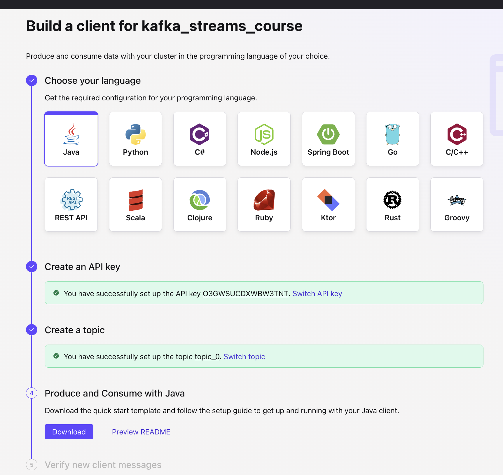
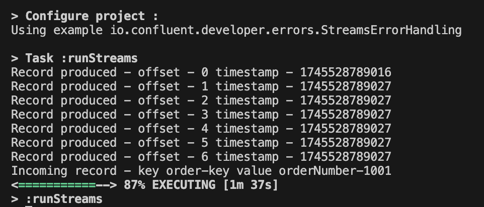
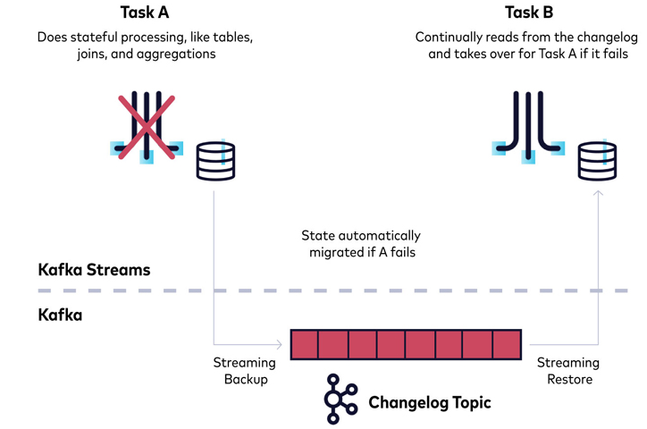
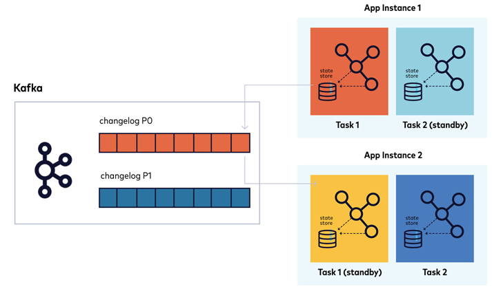

# Getting started

Here I documented the practical things that I have done in the below course<br/>
[Kafka Streams 101](https://developer.confluent.io/courses/kafka-streams/get-started/)

# Basic Operations

## Event Streams

An event represents data that corresponds to an action, such as a notification or state transfer. An event stream is an unbounded collection of event records.

## Key-Value Pairs

Apache Kafka® works in key-value pairs, so it’s important to understand that in an event stream, records that have the same key don't have anything to do with one another. For example, the image below shows four independent records, even though two of the keys are identical:


## Topologies

To represent the flow of stream processing, Kafka Streams uses topologies, which are directed acyclic graphs ("DAGs"). Each Kafka Streams topology has a source processor, where records are read in from Kafka. Below that are any number of child processors that perform some sort of operation. A child node can have multiple parent nodes, and a parent node can have multiple child nodes. It all feeds down to a sink processor, which writes out to Kafka.


## Streams

You define a stream with a **StreamBuilder**, for which you specify an input topic as well as SerDes (Serialization/Deserialization) configurations, via a **Consumed** configuration object. These settings—covered in detail in one of the later Modules — tells Kafka Streams how to read the records, which have **String**-typed keys and values in the below example. A **KStream** is part of the Kafka Streams DSL, and it’s one of the main constructs you'll be working with.

## Stream Operations

Once you've created a stream, you can perform basic operations on it, such as mapping and filtering.

### Mapping

With mapping, you take an input object of one type, apply a function to it, and then output it as a different object, potentially of another type. For example, using mapValues, you could convert a string to another string that omits the first five characters:

```java
mapValues(value -> value.substring(5))
```

**Map**, on the other hand, lets you change the key and the value:

```java
map((key, value) -> ..)
```

### Filtering

With a filter, you send a key and value, and only the records that match a predicate make it through to the other side.

```java
filter((key, value) -> Long.parseLong(value) > 1000)
```

# Hands On: Basic Operations

The Basic Operations exercise demonstrates how to use Kafka Streams stateless operations such as filter and mapValues. Note that the next few steps, including setting up Confluent Cloud, creating the properties, adding the application ID, and creating the StreamsBuilder, apply to each exercise but will only be shown in this one <br/><br/>

- Clone the course's GitHub repository and load it into your favorite IDE or editor

```bash
git clone https://github.com/confluentinc/learn-kafka-courses.git
```

- Change to the directory

```bash
cd kafka-streams
```

- Compile the source

```bash
./gradlew build
```

The source code in this course is compatible with Java 11, and this module's code can be found in the source file **java/io/confluent/developer/basic/BasicStreams.java**

If you get error like **Build Failed**, then you must check the version of java that you are using. In my case I was using java 22 but the gradle supports until java 17. So I had to downgrade my java. I used sdkman for this and below are my exact commands

```bash
curl -s "https://get.sdkman.io" | bash
source "$HOME/.sdkman/bin/sdkman-init.sh"
sdk install java 17.0.9-tem
sdk use java 17.0.9-tem
```

To ensure SDKMAN is initialized in all terminal sessions, I had to edit my shell config

```bash
vi ~/.zshrc
```

Add this line at the bottom (if it's not already there):

```
source "$HOME/.sdkman/bin/sdkman-init.sh"
```

When I tried the **./gradlew build** again with Java 17 then the Build was successful.

- Create a new cluster in Confluent Cloud. For the purposes of all the exercise modules you can use the Basic type. Name the cluster 'kafka_streams_course'.

- On the cluster's overview page, click **Clients - Java**. Then create an API key for the cluster and default topic. Finally download the 'quick start template'. Upzip the downloaded file and copy the content of client.properties



- Earlier we cloned a github repo called 'LEARN-KAFKA-COURSES'. Create a file named ccloud.properties in the src/main/resources directory. Then paste the configurations which we copied earlier into the ccloud.properties file.

- Now set up properties for the exercises (you are taking a couple of minor extra steps to make sure that any sensitive information doesn't get accidentally checked into GitHub). First make sure you are in src/main/resources. Then run the following commands

```bash
cat streams.properties.orig > streams.properties
cat ccloud.properties >> streams.properties
```

- Now go to the file and complete it 'LEARN-KAFKA-COURSES' - 'kafka-streams' - src - main - java/io/Confluent/developer - basic - BasicStreams.java. Below is the complete code. (Logic: Input topic - Streams (basic operations) - Output topic)

```java
package io.confluent.developer.basic;

import org.apache.kafka.common.serialization.Serdes;
import org.apache.kafka.streams.KafkaStreams;
import org.apache.kafka.streams.StreamsBuilder;
import org.apache.kafka.streams.StreamsConfig;
import org.apache.kafka.streams.kstream.Consumed;
import org.apache.kafka.streams.kstream.KStream;
import org.apache.kafka.streams.kstream.Produced;

import java.io.FileInputStream;
import java.io.IOException;
import java.time.Duration;
import java.util.Properties;
import java.util.concurrent.CountDownLatch;

public class BasicStreams {

    public static void main(String[] args) throws IOException {
        Properties streamsProps = new Properties(); //create a properties object
        //Use a FileInputStream to load properties from the file that includes your Confluent Cloud properties; in addition,
        // add the application configuration ID to the properties
        // Make sure you've added your Confluent Cloud credentials as outlined in the README
        try (FileInputStream fis = new FileInputStream("src/main/resources/streams.properties")) {
            streamsProps.load(fis);
        }
        streamsProps.put(StreamsConfig.APPLICATION_ID_CONFIG, "basic-streams");

        //Create a StreamsBuilder instance, and retrieve the name of the inputTopic and outputTopic from the Properties
        StreamsBuilder builder = new StreamsBuilder();
        final String inputTopic = streamsProps.getProperty("basic.input.topic");
        final String outputTopic = streamsProps.getProperty("basic.output.topic");

        //Create an order number variable (you'll see where it comes into play soon), and then create the KStream instance
        // (note the use of the inputTopic variable):
        final String orderNumberStart = "orderNumber-";
        // Using the StreamsBuilder from above, create a KStream with an input-topic
        // and a Consumed instance with the correct
        // Serdes for the key and value HINT: builder.stream and Serdes.String()
        KStream<String, String> firstStream = builder.stream(inputTopic, Consumed.with(Serdes.String(), Serdes.String()));

        //Add a peek operator (it's expected that you don't modify the keys and values). Here, it's printing records as they come into the topology
        firstStream.peek((key, value) -> System.out.println("Incoming record - key " + key + " value " + value))
                // filter records by making sure they contain the orderNumberStart variable from above HINT: use filter
                .filter((key, value) -> value.contains(orderNumberStart))
                // map the value to a new string by removing the orderNumberStart portion HINT: use mapValues
                .mapValues(value -> value.substring(value.indexOf("-") + 1))
                // only forward records where the value is 1000 or greater HINT: use filter and Long.parseLong
                .filter((key, value) -> Long.parseLong(value) > 1000)
                //an additional peek method to display the transformed records:
                .peek((key, value) -> System.out.println("Outgoing record - key " + key + " value " + value))
                // Write the results to an output topic defined above as outputTopic HINT: use "to" and Produced and Serdes.String()
                .to(outputTopic, Produced.with(Serdes.String(), Serdes.String()));

        //Create the Kafka Streams instance:
        try (KafkaStreams kafkaStreams = new KafkaStreams(builder.build(), streamsProps)) {
            //A CountDownLatch is created with a count of 1. This means the latch will block until the count is reduced to 0 by calling countDown() once
            final CountDownLatch shutdownLatch = new CountDownLatch(1);
            //A shutdown hook is registered with the JVM. This hook runs when the JVM is terminating (e.g., due to Ctrl+C, System.exit(), or an OS signal like SIGTERM).
            Runtime.getRuntime().addShutdownHook(new Thread(() -> {
                kafkaStreams.close(Duration.ofSeconds(2)); //Closes the Kafka Streams application
                shutdownLatch.countDown(); //Decrements the latch / reduces the latch count from 1 to 0, signaling that the shutdown is complete.
            }));
            TopicLoader.runProducer(); //Use this utility method to create the required topics on the cluster and produce some sample records
            try {
                kafkaStreams.start(); //Start the application
                shutdownLatch.await(); //causes the main thread to block and wait until the latch count reaches 0. This keeps the application running indefinitely until the shutdown hook triggers countDown()
            } catch (Throwable e) {
                System.exit(1); //If an exception occurs (e.g., during await() due to interruption), the application exits with a status code of 1 to indicate an error.
            }
        }
        System.exit(0);
    }
}
```

- Now you can run the basic operations example with this command

```bash
./gradlew runStreams -Pargs=basic
```

and your output on the console should resemble like the below. Take note that it's expected to not have a corresponding output record for each input record due to the filters applied by the Kafka Steams application.


# KTable

## Update Streams

The module Basic Operations defined event streams and mentioned that keys across records in event streams are completely independent of one another, even if they are identical. <br/><br/>

Update Streams are the exact opposite: if a new record comes in with the same key as an existing record, the existing record will be overwritten. This means that when using a KTable, keys are required, although they aren't required when using a KStream. By overwriting records, a KTable creates a completely different data structure from a KStream, even given the same source records.

## Defining a KTable

To define a KTable, you use a **StreamsBuilder**, as with a KStream, but you call **builder.table** instead of **builder.stream**. With the **builder.table** method, you provide an **inputTopic**, along with a **Materialized** configuration object specifying your SerDes (this replaces the **Consumed** object that you use with a KStream):

```java
 StreamsBuilder builder = new StreamsBuilder();
 KTable<String, String> firstKTable =
    builder.table(inputTopic,
    Materialized.with(Serdes.String(), Serdes.String()));
```

## KTable Operations

The KTable API has operations similar to those of the KStream API, including mapping and filtering.

### Mapping

As with KStream, mapValues transforms values and map lets you transform both keys and values.

```java
firstKTable.mapValues(value -> ..)
firstKTable.map((key,value) -> ..)
```

### Filtering

As with KStream, the filter operation lets you supply a predicate, and only records that match the predicate are forwarded to the next node in the topology:

```java
firstKTable.filter((key, value) -> ..)
```

## GlobalKTable

A GlobalKTable is built using the **GlobalKTable** method on the **StreamBuilder**. As with a regular KTable, you pass in a **Materialized** configuration with the SerDes:

```java
 StreamsBuilder builder = new StreamsBuilder();
 GlobalKTable<String, String> globalKTable =
    builder.globalTable(inputTopic,
    Materialized.with(Serdes.String(), Serdes.String()));
```

The main difference between a KTable and a GlobalKTable is that a KTable shards data between Kafka Streams instances, while a GlobalKTable extends a full copy of the data to each instance. You typically use a GlobalKTable with lookup data. There are also some idiosyncrasies regarding joins between a GlobalKTable and a KStream;

# Hands On: KTable

- This module’s code can be found in the source file src/main/java/io/confluent/developer/ktable/KTableExample.java.

- Below is the complete code

```java
package io.confluent.developer.ktable;

import org.apache.kafka.common.serialization.Serdes;
import org.apache.kafka.common.utils.Bytes;
import org.apache.kafka.streams.KafkaStreams;
import org.apache.kafka.streams.StreamsBuilder;
import org.apache.kafka.streams.StreamsConfig;
import org.apache.kafka.streams.kstream.KTable;
import org.apache.kafka.streams.kstream.Materialized;
import org.apache.kafka.streams.kstream.Produced;
import org.apache.kafka.streams.state.KeyValueStore;

import java.io.FileInputStream;
import java.io.IOException;
import java.time.Duration;
import java.util.Properties;
import java.util.concurrent.CountDownLatch;

public class KTableExample {

    public static void main(String[] args) throws IOException {
        final Properties streamsProps = new Properties();
        try (FileInputStream fis = new FileInputStream("src/main/resources/streams.properties")) {
            streamsProps.load(fis);
        }
        streamsProps.put(StreamsConfig.APPLICATION_ID_CONFIG, "ktable-application");

        StreamsBuilder builder = new StreamsBuilder();
        final String inputTopic = streamsProps.getProperty("ktable.input.topic");
        final String outputTopic = streamsProps.getProperty("ktable.output.topic");

        //creating a variable to store the string that we want to filter on
        final String orderNumberStart = "orderNumber-";

        // Crate a table with the StreamBuilder from above and use the table method
        // along with the inputTopic create a Materialized instance and name the store
        // and provide a Serdes for the key and the value  HINT: Materialized.<String, String, KeyValueStore<Bytes, byte[]>>as
        // then use two methods to specify the key and value serde
        KTable<String, String> firstKTable = builder.table(inputTopic,
    Materialized.<String, String, KeyValueStore<Bytes, byte[]>>as("ktable-store")
                .withKeySerde(Serdes.String())
                .withValueSerde(Serdes.String()));

        //Add a filter operator for removing records that don't contain the order number variable value
        firstKTable.filter((key, value) -> value.contains(orderNumberStart))
                // Map the values by taking a substring
                .mapValues(value -> value.substring(value.indexOf("-") + 1))
                // Then filter again by taking out records where the number value of the string is less than or equal to 1000:
                .filter((key, value) -> Long.parseLong(value) > 1000)
                // Add a method here to covert the table to a stream
                .toStream()
                // Then uncomment the following two lines to view results on the console and write to a topic
                .peek((key, value) -> System.out.println("Outgoing record - key " +key +" value " + value))
                .to(outputTopic, Produced.with(Serdes.String(), Serdes.String()));


        try (KafkaStreams kafkaStreams = new KafkaStreams(builder.build(), streamsProps)) {
            final CountDownLatch shutdownLatch = new CountDownLatch(1);

            Runtime.getRuntime().addShutdownHook(new Thread(() -> {
                kafkaStreams.close(Duration.ofSeconds(2));
                shutdownLatch.countDown();
            }));
            TopicLoader.runProducer();
            try {
                kafkaStreams.start();
                shutdownLatch.await();
            } catch (Throwable e) {
                System.exit(1);
            }
        }
        System.exit(0);
    }
}
```

- Now you can run the above with this command

```bash
./gradlew runStreams -Pargs=ktable
```

There's a single output result because the sample data for this exercise has the same key.


# Serialization

- Serialization is a general term that covers deserializing and serializing.
- When you push an array of bytes through a deserializer, it gives you an object on the other end
- A serializer is just the opposite—you give it an object, and it returns an array of bytes
- Serialization is important for Apache Kafka® because as mentioned above, a Kafka broker only works with bytes. Kafka stores records in bytes, and when a fetch request comes in from a consumer, Kafka returns records in bytes. The broker really knows nothing about its records; it just appends them to the end of a file, and that's the end of it.
- To bring data into Kafka Streams, you provide SerDes for your topic’s key and value in the Consumed configuration object. A SerDes is a convenience function, a wrapper around the serializer for a certain type and the deserializer for a certain type.

```java
StreamsBuilder builder = new StreamsBuilder()
KStream<String, MyObject> stream = builder.stream("topic",
    Consumed.with(Serdes.String(), customObjectSerde)
```

- Similarly, when you write out from Kafka Streams, you have to provide a SerDes to serialize your data. Note that with state stores, you would use a Materialized to provide the SerDes.

```java
KStream<String, CustomObject> modifiedStream =
    stream.filter( (key, value) -> value.startsWith(“ID5”))
.mapValues( value -> new CustomObject(value));

modifiedStream.to(“output-topic”, Produced.with(Serdes.String(), customObjectSerde);
```

- To create a custom SerDes, use the factory method Serdes.serdeFrom and pass both a serializer instance and a deserializer instance. Creating your own serializer and deserializer is actually not that difficult. Consult the documentation to accomplish it. You just need to implement the Serializer and Deserializer interfaces from the org.apache.kafka.clients package.

```java
Serde<T> serde = Serdes.serdeFrom( new CustomSerializer<T>,
    new CustomDeserializer<T>);
```

- Out of the box, Kafka Streams includes SerDes for String, Integer, Double, Long, Float, Bytes, ByteArray, and ByteBuffer types.

# Joins

Kafka Streams provides join operations for streams and tables, enabling you to augment one dataset with another.

## Stream-Stream

- Stream-stream joins combine two event streams into a new stream. The streams are joined based on a common key, so keys are necessary. You define a time window, and records on either side of the join need to arrive within the defined window. Kafka Streams uses a state store under the hood to buffer records, so that when a record arrives, it can look in the other stream's state store and find records by key that fit into the time window, based on timestamps

- To enact a join, you use a ValueJoiner, an interface that takes the value from the left side, the primary part of the join, and the value from the right side, the secondary join operator. You use this to compute a new value, which potentially could be of a new type (you decide what the return type will be). You can also use keys in a read-only fashion to compute the new value

### Inner Joins

If both sides are available during the window, a join is emitted. Thus, if the left side has a record but the right side doesn't, nothing is emitted.

### Outer Joins

With an outer join, both sides always produce an output record. Within the join window, if both the left side and the right side are available, a join of the two is returned. If only the left side is available, the join will have the value of the left side and a null for the right side. The converse is true: If only the right side is available, the join will include the value of the right side and a null for the left side.

### Left-Outer Joins

Left-outer joins also always produce output records. If both sides are available, the join consists of both sides. Otherwise, the left side will be returned with a null for the right side.

## Stream-Table

You learned above that stream-stream joins are windowed joins. Conversely, the types available for stream-table joins are non-windowed. You can join a KStream with a KTable and a KStream with a GlobalKTable.

In a stream-table join, the stream is always on the primary side; it drives the join. Only new records arriving to the stream result in an output, and new records arriving to the table do not (this is the case for both KStream-KTable and KStream-GlobalKTable joins).

### Inner

An inner join only fires if both sides are available.

### Left Outer

The KStream always produces a record, either a combination of the left and right values, or the left value and a null representing the right side.

### GlobalKTable-Stream Join Properties

- With a GlobalKTable, you get full replication of the underlying topic across all instances, as opposed to sharding. GlobalKTable provides a mechanism whereby, when you perform a join with a KStream, the key of the stream doesn't have to match. You get a KeyValueMapper when you define the join, and you can derive the key to match the GlobalKTable key using the stream key and/or value.

- Yet another difference between a KTable join and a GlobalKTable join is the fact that a KTable uses timestamps. With a GlobalKTable, when there is an update to the underlying topic, the update is just automatically applied. It's divorced completely from the time mechanism within Kafka Streams. (In contrast, with a KTable, timestamps are part of your event stream processing.) This means that a GlobalKTable is suited for mostly static lookup data. For example, you might use it to hold relatively static user information for matching against transactions.

## Table-Table

You can also join a KTable with a KTable. Note that you can only join a GlobalKTable with a KStream.

## A Code Example: Joining Two Streams

A **ValueJoiner** takes left and right values and returns a new value. You can return a completely new object type altogether—the return value type doesn't have to be the same as the two values coming in. Notice also the **JoinWindows** argument, which states that an event on the right side needs to have a timestamp either 10 seconds before the left-stream side or 10 seconds after the left-stream side.

```java
KStream<String, String> leftStream = builder.stream("topic-A");
KStream<String, String> rightStream = builder.stream("topic-B");

ValueJoiner<String, String, String> valueJoiner = (leftValue, rightValue) -> {
    return leftValue + rightValue;
};
leftStream.join(rightStream,
                valueJoiner,
                JoinWindows.of(Duration.ofSeconds(10)));
```

# Hands On: Joins

This module’s code can be found in the source file 'java/io/confluent/developer/joins/StreamsJoin.java'. Here is the solution

```java
package io.confluent.developer.joins;

import io.confluent.developer.StreamsUtils;
import io.confluent.developer.avro.ApplianceOrder;
import io.confluent.developer.avro.CombinedOrder;
import io.confluent.developer.avro.ElectronicOrder;
import io.confluent.developer.avro.User;
import io.confluent.kafka.streams.serdes.avro.SpecificAvroSerde;
import org.apache.avro.specific.SpecificRecord;
import org.apache.kafka.common.serialization.Serdes;
import org.apache.kafka.streams.KafkaStreams;
import org.apache.kafka.streams.StreamsBuilder;
import org.apache.kafka.streams.StreamsConfig;
import org.apache.kafka.streams.kstream.Consumed;
import org.apache.kafka.streams.kstream.JoinWindows;
import org.apache.kafka.streams.kstream.Joined;
import org.apache.kafka.streams.kstream.KStream;
import org.apache.kafka.streams.kstream.KTable;
import org.apache.kafka.streams.kstream.Materialized;
import org.apache.kafka.streams.kstream.Produced;
import org.apache.kafka.streams.kstream.StreamJoined;
import org.apache.kafka.streams.kstream.ValueJoiner;

import java.io.IOException;
import java.time.Duration;
import java.time.Instant;
import java.util.Map;
import java.util.Properties;
import java.util.concurrent.CountDownLatch;

public class StreamsJoin {

//Use a static helper method to get SerDes for your Avro records
//(in subsequent exercises, you'll abstract this into a static utility method, in the StreamsUtils class of the course repo)
    static <T extends SpecificRecord> SpecificAvroSerde<T> getSpecificAvroSerde(final Map<String, Object> serdeConfig) {
        final SpecificAvroSerde<T> specificAvroSerde = new SpecificAvroSerde<>();
        specificAvroSerde.configure(serdeConfig, false);
        return specificAvroSerde;
    }

    public static void main(String[] args) throws IOException {
//Use a utility method to load the properties (you can refer to the StreamsUtils class within the exercise source code)
        Properties streamsProps = StreamsUtils.loadProperties();
        streamsProps.put(StreamsConfig.APPLICATION_ID_CONFIG, "joining-streams");

        StreamsBuilder builder = new StreamsBuilder();
//Get the input topic names and the output topic name from the properties
        String streamOneInput = streamsProps.getProperty("stream_one.input.topic");
        String streamTwoInput = streamsProps.getProperty("stream_two.input.topic");
        String tableInput = streamsProps.getProperty("table.input.topic");
        String outputTopic = streamsProps.getProperty("joins.output.topic");
//Create a HashMap of the configurations
        Map<String, Object> configMap = StreamsUtils.propertiesToMap(streamsProps);
//Then create the required SerDes for all streams and for the table
        SpecificAvroSerde<ApplianceOrder> applianceSerde = getSpecificAvroSerde(configMap);
        SpecificAvroSerde<ElectronicOrder> electronicSerde = getSpecificAvroSerde(configMap);
        SpecificAvroSerde<CombinedOrder> combinedSerde = getSpecificAvroSerde(configMap);
        SpecificAvroSerde<User> userSerde = getSpecificAvroSerde(configMap);
//Create the ValueJoiner for the stream-table join
//The stream is a result of the preceding stream-stream join, but it's a left outer join, because the right-side record might not exist
        ValueJoiner<ApplianceOrder, ElectronicOrder, CombinedOrder> orderJoiner =
                (applianceOrder, electronicOrder) -> CombinedOrder.newBuilder()
                        .setApplianceOrderId(applianceOrder.getOrderId())
                        .setApplianceId(applianceOrder.getApplianceId())
                        .setElectronicOrderId(electronicOrder.getOrderId())
                        .setTime(Instant.now().toEpochMilli())
                        .build();

        ValueJoiner<CombinedOrder, User, CombinedOrder> enrichmentJoiner = (combined, user) -> {
            if (user != null) {
                combined.setUserName(user.getName());
            }
            return combined;
        };
//Create the ApplianceOrder stream as well as the ElectronicOrder stream
        KStream<String, ApplianceOrder> applianceStream =
                builder.stream(streamOneInput, Consumed.with(Serdes.String(), applianceSerde))
                        .peek((key, value) -> System.out.println("Appliance stream incoming record key " + key + " value " + value));

        KStream<String, ElectronicOrder> electronicStream =
                builder.stream(streamTwoInput, Consumed.with(Serdes.String(), electronicSerde))
                        .peek((key, value) -> System.out.println("Electronic stream incoming record " + key + " value " + value));
//From here, create the User table
        KTable<String, User> userTable =
                builder.table(tableInput, Materialized.with(Serdes.String(), userSerde));

        KStream<String, CombinedOrder> combinedStream =
        // create a Join between the applianceStream and the electronicStream
        // using the ValueJoiner created above, orderJoiner gets you the correct value type of CombinedOrder
        // You want to join records within 30 minutes of each other HINT: JoinWindows and Duration.ofMinutes
        // Add the correct Serdes for the join state stores remember both sides have same key type
        // HINT: StreamJoined and Serdes.String  and Serdes for the applianceStream and electronicStream created above

        // Optionally add this statement after the join to see the results on the console
        // .peek((key, value) -> System.out.println("Stream-Stream Join record key " + key + " value " + value));
        // Now that you have the combinedStream, you can join it with the userTable
                        applianceStream.join(
                                electronicStream,
                                orderJoiner,
                                JoinWindows.of(Duration.ofMinutes(30)),
                                StreamJoined.with(Serdes.String(), applianceSerde, electronicSerde))
                        .peek((key, value) -> System.out.println("Stream-Stream Join record key " + key + " value " + value));

        // Now join the combinedStream with the userTable,
        // but you'll always want a result even if no corresponding entry is found in the table
        // Using the ValueJoiner created above, enrichmentJoiner, return a CombinedOrder instance enriched with user information
        // You'll need to add a Joined instance with the correct Serdes for the join state store

        // Add these two statements after the join call to print results to the console and write results out
        // to a topic

        // .peek((key, value) -> System.out.println("Stream-Table Join record key " + key + " value " + value))
        // .to(outputTopic, Produced.with(Serdes.String(), combinedSerde));
        combinedStream.leftJoin(
                        userTable,
                        enrichmentJoiner,
                        Joined.with(Serdes.String(), combinedSerde, userSerde))
                .peek((key, value) -> System.out.println("Stream-Table Join record key " + key + " value " + value))
                .to(outputTopic, Produced.with(Serdes.String(), combinedSerde));


        try (KafkaStreams kafkaStreams = new KafkaStreams(builder.build(), streamsProps)) {
            final CountDownLatch shutdownLatch = new CountDownLatch(1);

            Runtime.getRuntime().addShutdownHook(new Thread(() -> {
                kafkaStreams.close(Duration.ofSeconds(2));
                shutdownLatch.countDown();
            }));
            TopicLoader.runProducer();
            try {
                kafkaStreams.start();
                shutdownLatch.await();
            } catch (Throwable e) {
                System.exit(1);
            }
        }
        System.exit(0);
    }
}
```

- You can run the joins example with this command:

```bash
./gradlew runStreams -Pargs=joins
```

- The output for the exercise should like this:
  

- I had to add the schema registry configs in the **streams.properties** file inorder to make this work

```bash
schema.registry.url=https://abcd-fgt456.us-south4.gcp.confluent.cloud
basic.auth.credentials.source=USER_INFO
basic.auth.user.info=API_KEY:API_SECRET
```

# Stateful Operations

Stateless operations in Kafka Streams are quite useful if you are just filtering or doing some other operation that doesn't need to collect data. In other scenarios, however, you may need to remember something about previous records. For example, you may want to know how many times a specific customer has logged in, or the total number of tickets sold.<br/>

In a stateful operation, you typically group by key first, so keys have to be present. If they're not, you can derive a key, but you will have to repartition. Repartitioning is basically the act of writing back out to a topic so that keys will end up on correct partitions. If you create a new key, chances are that it will not be on the partition where it belongs.<br/>

Stateful operations in Kafka Streams are backed by state stores. The default is a persistent state store implemented in RocksDB, but you can also use in-memory stores. State stores are backed up by a changelog topic, making state in Kafka Streams fault-tolerant. When you call a stateful operation, a KTable is returned (recall that in a table, new values overwrite previous ones). Stateful operations in Kafka Streams include reduce, count, and aggregate.<br/>

## Reduce

With reduce, you take an interface of Reducer, a Single Abstract Method that takes one value type as a parameter, and you apply an operation. Reduce expects you to return the same type. Here is a reduce that sums

```java
StreamsBuilder builder = new StreamsBuilder();
KStream<String, Long> myStream = builder.stream("topic-A");
Reducer<Long> reducer = (longValueOne, longValueTwo) -> longValueOne + longValueTwo;
myStream.groupByKey().reduce(reducer,
                             Materialized.with(Serdes.String(), Serdes.Long()))
                            .toStream().to("output-topic");
```

You create your stream, then group by key (this assumes that your stream is correctly keyed). Then you call **reduce** and pass in your **reducer**. Notice also that you are providing SerDes for the store in **Materialized**. There's a chance that you would have defined your SerDes up front, either via a **Consumed** object or via configuration. So if you had defined the SerDes for the key as a string and the value as a long via your configuration, you wouldn't need to do this. But typically, it's best to provide SerDes here; it will be clearer when you go to look back at the code (RocksDB and in-memory stores don't store objects, but bytes). Notice also that **reduce** returns a KTable, but the **to** operator doesn't exist in the KTable API, so we have to convert to a stream: We're converting our records stream to an event stream, and writing it to an output topic.

## Aggregation

Aggregate is a form of reduce, but with aggregate, you can return a different type:

```java
StreamsBuilder builder = new StreamsBuilder();
KStream<String, String> myStream = builder.stream("topic-A");

Aggregator<String, String, Long> characterCountAgg =
    (key, value, charCount) -> value.length() + charCount;
myStream.groupByKey().aggregate(() -> 0L,
                                      characterCountAgg,
                                      Materialized.with(Serdes.String(), Serdes.Long()))
                                      .toStream().to("output-topic");
```

In this example, our inputs are strings: a string key and a string value. With **aggregate** in Kafka Streams, you provide an **initializer** and an **aggregator**. Our **initializer** in this case adds a zero value as a long, and then we have **characterCountAgg**, which basically takes the key and value and the previous count. You take the length of your string and add it to the previous count so that it builds up a running count. Here, it's critical that we provide the SerDes for the state store, because we're changing the type. (The type of our stream is string/string for the key/value, but for our store, it's going to be string/long.) Then we call **.toStream()** and send to an output topic.

## Considerations

Stateful operations don't emit results immediately. Kafka Streams has an internal buffering mechanism that caches results. Two factors control when the cache emits records: Records are emitted when the cache is full (defined equally per instance among the number of stores; it's 10MB), and by default, Kafka Streams calls **commit** every 30 seconds (you don't call **commit** yourself). At this point, you would see an update. In order to see every update that comes through your aggregation, you can set your cache size to zero (which is also useful for debugging).

Even with caching, you will get multiple results, so for a single and final stateful result, you should use suppression overloads with **aggregate/reduce** operations.

# Hands On: Aggregations

This module’s code can be found in the source file 'java/io/confluent/developer/aggregate/StreamsAggregate.java'. Here is the final code

```java
package io.confluent.developer.aggregate;

import io.confluent.developer.StreamsUtils;
import io.confluent.developer.avro.ElectronicOrder;
import io.confluent.kafka.streams.serdes.avro.SpecificAvroSerde;
import org.apache.kafka.common.serialization.Serdes;
import org.apache.kafka.streams.KafkaStreams;
import org.apache.kafka.streams.StreamsBuilder;
import org.apache.kafka.streams.StreamsConfig;
import org.apache.kafka.streams.kstream.Consumed;
import org.apache.kafka.streams.kstream.KStream;
import org.apache.kafka.streams.kstream.Materialized;
import org.apache.kafka.streams.kstream.Produced;

import java.io.IOException;
import java.time.Duration;
import java.util.Map;
import java.util.Properties;
import java.util.concurrent.CountDownLatch;

public class StreamsAggregate {

    public static void main(String[] args) throws IOException {

        final Properties streamsProps = StreamsUtils.loadProperties();
        streamsProps.put(StreamsConfig.APPLICATION_ID_CONFIG, "aggregate-streams");

        StreamsBuilder builder = new StreamsBuilder();
//let’s extract the names of the topics from the configuration, which we’ve already loaded via a static helper method.
// Then we’ll convert the properties to a HashMap and use another utility method to create the specific record AvroSerde
        final String inputTopic = streamsProps.getProperty("aggregate.input.topic");
        final String outputTopic = streamsProps.getProperty("aggregate.output.topic");
        final Map<String, Object> configMap = StreamsUtils.propertiesToMap(streamsProps);

        final SpecificAvroSerde<ElectronicOrder> electronicSerde =
                StreamsUtils.getSpecificAvroSerde(configMap);

//Create the electronic orders stream
        final KStream<String, ElectronicOrder> electronicStream =
                builder.stream(inputTopic, Consumed.with(Serdes.String(), electronicSerde))
                        .peek((key, value) -> System.out.println("Incoming record - key " + key + " value " + value));

        // Now take the electronicStream object, group by key and perform an aggregation
        // Don't forget to convert the KTable returned by the aggregate call back to a KStream using the toStream method
//Execute a groupByKey followed by aggregate (initialize the aggregator with "0.0," a double value)
        electronicStream.groupByKey().aggregate(() -> 0.0,
//Now add the aggregator implementation, which takes each order and adds the price to a running total, a sum of all electronic orders.
//Also add a Materialized, which is necessary to provide state store SerDes since the value type has changed
                (key, order, total) -> total + order.getPrice(),
                Materialized.with(Serdes.String(), Serdes.Double()))
//Call toStream() on the KTable that results from the aggregation operation, add a peek operation to print the results of the aggregation, and then add a .to operator to write the results to a topic
                .toStream()

        // To view the results of the aggregation consider
        // right after the toStream() method .peek((key, value) -> System.out.println("Outgoing record - key " +key +" value " + value))
                .peek((key, value) -> System.out.println("Outgoing record - key " +key +" value " + value))
        // Finally write the results to an output topic
                .to(outputTopic, Produced.with(Serdes.String(), Serdes.Double()));

        try (KafkaStreams kafkaStreams = new KafkaStreams(builder.build(), streamsProps)) {
            final CountDownLatch shutdownLatch = new CountDownLatch(1);

            Runtime.getRuntime().addShutdownHook(new Thread(() -> {
                kafkaStreams.close(Duration.ofSeconds(2));
                shutdownLatch.countDown();
            }));
            TopicLoader.runProducer();
            try {
                kafkaStreams.start();
                shutdownLatch.await();
            } catch (Throwable e) {
                System.exit(1);
            }
        }
        System.exit(0);
    }
}
```

- You can run the above with this command:

```bash
./gradlew runStreams -Pargs=aggregate
```

- The output for the exercise should like this:
  

# Windowing

Windowing allows you to bucket stateful operations by time, without which your aggregations would endlessly accumulate. A window gives you a snapshot of an aggregate within a given timeframe, and can be set as hopping, tumbling, session, or sliding.

## Hopping

- Imagine that you're building a stream and you simply need to count your instances by key

```java
KStream<String, String> myStream = builder.stream("topic-A");
myStream.groupByKey().count().toStream().to("output")
```

- The problem is that, over time, your count is going to continue to grow. So you need to window your results in order to get a sense of how your count fluctuates

```java
KStream<String, String> myStream = builder.stream("topic-A");
Duration windowSize = Duration.ofMinutes(5);
Duration advanceSize = Duration.ofMinutes(1);
TimeWindows hoppingWindow = TimeWindows.of(windowSize).advanceBy(advanceSize);
myStream.groupByKey()
    .windowedBy(hoppingWindow)
    .count();
```

A hopping window is bound by time: You define the size of the window, but then it advances in increments smaller than the window size, so you end up with overlapping windows. You might have a window size of 30 seconds with an advance size of five seconds. Data points can belong to more than one window.

## Tumbling

A tumbling window is a special type of hopping window. It's a hopping window with an advance size that's the same as its window size. So basically you just define a window size of 30 seconds. When 30 seconds are up, you get a new window with a time of 30 seconds. So you don't get duplicate results like you do with the overlapping in hopping windows

```java
KStream<String, String> myStream = builder.stream("topic-A");
Duration windowSize = Duration.ofSeconds(30);
TimeWindows tumblingWindow = TimeWindows.of(windowSize);

myStream.groupByKey()
    .windowedBy(tumblingWindow)
    .count();
```

## Session

Session windows are different from the previous two types because they aren't defined by time, but rather by user activity

```java
KStream<String, String> myStream = builder.stream("topic-A");
Duration inactivityGap = Duration.ofMinutes(5);

myStream.groupByKey()
    .windowedBy(SessionWindows.with(inactivityGap))
    .count();
```

So with session windows, you define an inactivityGap. Basically, as long as a record comes in within the inactivityGap, your session keeps growing. So theoretically, if you're keeping track of something and it's a very active key, your session will continue to grow

## Sliding

A sliding window is bound by time, but its endpoints are determined by user activity. So you create your stream and set a maximum time difference between two records that will allow them to be included in the first window.

```java
 KStream<String, String> myStream = builder.stream("topic-A");
 Duration timeDifference = Duration.ofSeconds(2);
 Duration gracePeriod = Duration.ofMillis(500);
 myStream.groupByKey()
    .windowedBy(SlidingWindows.withTimeDifferenceAndGrace(timeDifference, gracePeriod))
    .count();
```

The window doesn't continuously advance, as with a hopping window, but advances based on user activity.

## Grace Periods

With the exception of session windows, which are behavior-driven, all windows have the concept of a grace period. A grace period is an extension to the size of a window. Specifically, it allows events with timestamps greater than the window-end (but less than the window-end plus the grace period) to be included in the windowed calculation.

# Hands On: Windowing

- This module’s code can be found in the source file java/io/confluent/developer/windows/StreamsWindows.java

- In this hands-on exercise, you will write a windowed aggregation. Note that the application you'll build uses the default timestamp extractor **FailOnInvalidTimestamp**.

Here is the final code

```java
package io.confluent.developer.windows;

import io.confluent.developer.StreamsUtils;
import io.confluent.developer.avro.ElectronicOrder;
import io.confluent.kafka.streams.serdes.avro.SpecificAvroSerde;
import org.apache.kafka.common.serialization.Serdes;
import org.apache.kafka.streams.KafkaStreams;
import org.apache.kafka.streams.KeyValue;
import org.apache.kafka.streams.StreamsBuilder;
import org.apache.kafka.streams.StreamsConfig;
import org.apache.kafka.streams.kstream.Consumed;
import org.apache.kafka.streams.kstream.KStream;
import org.apache.kafka.streams.kstream.Materialized;
import org.apache.kafka.streams.kstream.Produced;
import org.apache.kafka.streams.kstream.TimeWindows;

import java.io.IOException;
import java.time.Duration;
import java.util.Map;
import java.util.Properties;
import java.util.concurrent.CountDownLatch;

import static org.apache.kafka.streams.kstream.Suppressed.*;
import static org.apache.kafka.streams.kstream.Suppressed.BufferConfig.*;

public class StreamsWindows {

    public static void main(String[] args) throws IOException {

        final Properties streamsProps = StreamsUtils.loadProperties();
        streamsProps.put(StreamsConfig.APPLICATION_ID_CONFIG, "windowed-streams");

        StreamsBuilder builder = new StreamsBuilder();
        final String inputTopic = streamsProps.getProperty("windowed.input.topic");
        final String outputTopic = streamsProps.getProperty("windowed.output.topic");
        final Map<String, Object> configMap = StreamsUtils.propertiesToMap(streamsProps);

        final SpecificAvroSerde<ElectronicOrder> electronicSerde =
                StreamsUtils.getSpecificAvroSerde(configMap);
//Use builder.stream to create a KStream named electronicStream, with a peek operator to observe incoming events
        final KStream<String, ElectronicOrder> electronicStream =
                builder.stream(inputTopic, Consumed.with(Serdes.String(), electronicSerde))
                        .peek((key, value) -> System.out.println("Incoming record - key " + key + " value " + value));

        electronicStream.groupByKey()
                // Window the aggregation by the hour and allow for records to be up 5 minutes late
                .windowedBy(TimeWindows.of(Duration.ofHours(1)).grace(Duration.ofMinutes(5)))
                .aggregate(() -> 0.0,
                        (key, order, total) -> total + order.getPrice(),
//Add SerDes for the types in the aggregation, which are used by the state store. Then, add a suppress operator in order to not emit any updates until the window closes
                        Materialized.with(Serdes.String(), Serdes.Double()))
                        .suppress(untilWindowCloses(unbounded()))
                // Don't emit results until the window closes HINT suppression
                .toStream()
                // When windowing Kafka Streams wraps the key in a Windowed class
                // After converting the table to a stream it's a good idea to extract the
                // Underlying key from the Windowed instance HINT: use map
                .map((wk, value) -> KeyValue.pair(wk.key(),value))
                .peek((key, value) -> System.out.println("Outgoing record - key " + key + " value " + value))
                .to(outputTopic, Produced.with(Serdes.String(), Serdes.Double()));

        try (KafkaStreams kafkaStreams = new KafkaStreams(builder.build(), streamsProps)) {
            final CountDownLatch shutdownLatch = new CountDownLatch(1);

            Runtime.getRuntime().addShutdownHook(new Thread(() -> {
                kafkaStreams.close(Duration.ofSeconds(2));
                shutdownLatch.countDown();
            }));
            TopicLoader.runProducer();
            try {
                kafkaStreams.start();
                shutdownLatch.await();
            } catch (Throwable e) {
                System.exit(1);
            }
        }
        System.exit(0);
    }
}
```

- You can run the above with this command:

```bash
./gradlew runStreams -Pargs=windows
```

- The output for the exercise should like this:
  

Note that the example uses simulated timestamps for the different keys, so the results only approximate what you would see in production

# Time Concepts

Timestamps are a critical component of Apache Kafka®, and they similarly drive the behavior of Kafka Streams. You can configure timestamps to follow either event time (the default) or log-append time.

## Event Time

With event time, producers automatically create a timestamp with the current time of the producer's environment if you don't add your own.

## Log-Append Time

With log-append time, when the record arrives at the broker, the broker will override the timestamp of the producer record with its own timestamp (the current time of the broker environment) as it appends the record to the log.

## Timestamps Drive the Action in Kafka Streams

The windowing operations that you learned about in the **Windowing module** are driven by record timestamps, not by wall-clock time. In Kafka Streams, the earliest timestamp across all partitions is chosen first for processing, and Kafka Streams uses the **TimeStampExtractor** interface to get the timestamp from the current record.

The default behavior is to use the timestamp from a **ConsumerRecord**, which has a timestamp set by either the producer or the broker. The default implementation of **TimeStampExtractor** is **FailOnInvalidTimestamp**, which means that if you get a timestamp less than zero, it will throw an exception. If you want to use a timestamp that is embedded in the record key or value itself, you can provide a custom **TimeStampExtractor**.

## Stream Time

Kafka Streams uses the concept of stream time:


Stream time, by definition, is the largest timestamp seen so far, and it only moves forward, not backward. If an out-of-order record arrives (meaning a record that is earlier than the current stream time, but still within the window plus the grace period), stream time stays where it is.<br/>

Late records have timestamps outside of the combined window time and grace period. The delay of a record is determined by taking the stream time minus the event timestamp.


# Hands On: Time Concepts

- This module’s code can be found in the source file 'java/io/confluent/developer/time/StreamsTimestampExtractor.java'

- In this hands-on exercise, learn how to use a custom **TimestampExtractor** to drive the behavior of a Kafka Streams application, using timestamps embedded in the records themselves. Below is the final code

```java
package io.confluent.developer.time;

import io.confluent.developer.StreamsUtils;
import io.confluent.developer.avro.ElectronicOrder;
import io.confluent.kafka.streams.serdes.avro.SpecificAvroSerde;
import org.apache.kafka.clients.consumer.ConsumerRecord;
import org.apache.kafka.common.serialization.Serdes;
import org.apache.kafka.streams.KafkaStreams;
import org.apache.kafka.streams.KeyValue;
import org.apache.kafka.streams.StreamsBuilder;
import org.apache.kafka.streams.StreamsConfig;
import org.apache.kafka.streams.kstream.Consumed;
import org.apache.kafka.streams.kstream.KStream;
import org.apache.kafka.streams.kstream.Materialized;
import org.apache.kafka.streams.kstream.Produced;
import org.apache.kafka.streams.kstream.TimeWindows;
import org.apache.kafka.streams.processor.TimestampExtractor;

import java.io.IOException;
import java.time.Duration;
import java.util.Map;
import java.util.Properties;
import java.util.concurrent.CountDownLatch;

public class StreamsTimestampExtractor {

//Above the main method, create an instance of a TimestampExtractor, implementing the extract method and retrieving the ElectronicOrder object from the ConsumerRecord value field;
//then extract and return the timestamp embedded in the `ElectronicOrder':
    static class OrderTimestampExtractor implements TimestampExtractor {
        @Override
        public long extract(ConsumerRecord<Object, Object> record, long partitionTime) {
            // Extract the timestamp from the value in the record
            ElectronicOrder order = (ElectronicOrder)record.value();
            System.out.println("Extracting time of " + order.getTime() + " from " + order);
            // and return that instead
            return order.getTime();

        }
    }

    public static void main(String[] args) throws IOException {

        final Properties streamsProps = StreamsUtils.loadProperties();
        streamsProps.put(StreamsConfig.APPLICATION_ID_CONFIG, "extractor-windowed-streams");

        StreamsBuilder builder = new StreamsBuilder();
        final String inputTopic = streamsProps.getProperty("extractor.input.topic");
        final String outputTopic = streamsProps.getProperty("extractor.output.topic");
        final Map<String, Object> configMap = StreamsUtils.propertiesToMap(streamsProps);

        final SpecificAvroSerde<ElectronicOrder> electronicSerde =
                StreamsUtils.getSpecificAvroSerde(configMap);

        final KStream<String, ElectronicOrder> electronicStream =
                builder.stream(inputTopic,
                                Consumed.with(Serdes.String(), electronicSerde)
                                    .withTimestampExtractor(new OrderTimestampExtractor()))
                        //Wire up the timestamp extractor HINT do it on the Consumed object vs configs
                        .peek((key, value) -> System.out.println("Incoming record - key " + key + " value " + value));

        electronicStream.groupByKey().windowedBy(TimeWindows.of(Duration.ofHours(1)))
                .aggregate(() -> 0.0,
                        (key, order, total) -> total + order.getPrice(),
                        Materialized.with(Serdes.String(), Serdes.Double()))
                .toStream()
                .map((wk, value) -> KeyValue.pair(wk.key(), value))
                .peek((key, value) -> System.out.println("Outgoing record - key " + key + " value " + value))
                .to(outputTopic, Produced.with(Serdes.String(), Serdes.Double()));

        try (KafkaStreams kafkaStreams = new KafkaStreams(builder.build(), streamsProps)) {
            final CountDownLatch shutdownLatch = new CountDownLatch(1);

            Runtime.getRuntime().addShutdownHook(new Thread(() -> {
                kafkaStreams.close(Duration.ofSeconds(2));
                shutdownLatch.countDown();
            }));
            TopicLoader.runProducer();
            try {
                kafkaStreams.start();
                shutdownLatch.await();
            } catch (Throwable e) {
                System.exit(1);
            }
        }
        System.exit(0);
    }
}
```

- You can run the above with this command:

```bash
./gradlew runStreams -Pargs=time
```

- The output for the exercise should like this:
  

# Processor API

- So far you've learned about the Kafka Streams DSL, which gives you maximum developer velocity when building an application, but is very opinionated. Sometimes you need to accomplish things that aren't provided to you by the DSL, and that's where the Processor API comes in. It gives you maximum flexibility, but you are responsible for all of the details

The Processor API gives you access to state stores for custom stateful operations. In the **Stateful Operations** module, you learned about state and the DSL, which uses under-the-hood state stores that you can't directly access. With the Processor API, you create a store that you pass in, so you have full access to the store: You can pull out all of the records, you can do a range query, you can do all sorts of things. You can also programmatically call commit, and you can control how often it's called.

## Punctuation

Punctuation gives you the ability to schedule arbitrary operations. When you schedule a punctuator, it can use either stream-time processing or wall-clock-time processing.

### Stream-Time Processing

With stream-time processing, you schedule punctuation for an arbitrary action that you want to fire periodically—every 30 seconds, for example—and the action is driven by the timestamps on the records.

### Wall-Clock-Time Processing

You can also schedule punctuation according to wall-clock time. Under the hood, Kafka Streams uses a consumer, and consumers call poll() to get records. Wall-clock time advances with the poll() calls. So wall-clock time advancement depends in part on how long it takes you to return from a poll() loop.

## Building Streams Applications with the Processor API

You will recall the Kafka Streams topology from the **Basic Operations** module. Related to that, Kafka Streams applications with the Processor API are typically built as follows:

- Add source node(s)
- Add N number of processors, child nodes of the source node(s) (child nodes can have any number of parents)
- Optionally create StoreBuilder instances and attach them to the processor nodes to give them access to state stores
- Add sink node(s), to which one or more parent nodes forward records

When you create nodes, you need to provide a name for each one, since you use the name of one node as the parent name of another. As mentioned, a node can have more than one child node, but you can be selective about the nodes to which you forward records.

### Creating a Topology with the Processor API

Creating a topology involves straightforward code:

```java
Topology topology = new Topology();

topology.addSource(“source-node”, “topicA”, ”topicB”);

topology.addProcessor(“custom-processor”, new CustomProcessorSupplier(storeName), “source-node”);

toplogy.addSink(“sink-node”, “output-topic”, “custom-processor”);
```

First you create an instance and add a source node. Then you add a custom processor, whose parent is the source node. Finally, you create a sink node, whose parent is the custom processor. For any one of these nodes, you can have multiple parent nodes and multiple child nodes—this is just a simple example.

# Hands On: Processor API

- This module’s code can be found in the source file 'java/io/confluent/developer/processor/ProcessorApi.java'.
- In this exercise, you will create an aggregation that calls a punctuation every 30 seconds. You'll use a **ProcessorSupplier** and **Processor** instance, whereby the **Processor** will contain all of your stream processing logic.
- Here is the final code

```java
package io.confluent.developer.processor;

import io.confluent.developer.avro.ElectronicOrder;
import io.confluent.kafka.streams.serdes.avro.SpecificAvroSerde;
import org.apache.kafka.common.serialization.Serde;
import org.apache.kafka.common.serialization.Serdes;
import org.apache.kafka.streams.KafkaStreams;
import org.apache.kafka.streams.KeyValue;
import org.apache.kafka.streams.StreamsConfig;
import org.apache.kafka.streams.Topology;
import org.apache.kafka.streams.processor.PunctuationType;
import org.apache.kafka.streams.processor.api.Processor;
import org.apache.kafka.streams.processor.api.ProcessorContext;
import org.apache.kafka.streams.processor.api.ProcessorSupplier;
import org.apache.kafka.streams.processor.api.Record;
import org.apache.kafka.streams.state.KeyValueIterator;
import org.apache.kafka.streams.state.KeyValueStore;
import org.apache.kafka.streams.state.StoreBuilder;
import org.apache.kafka.streams.state.Stores;

import java.io.IOException;
import java.time.Duration;
import java.util.Collections;
import java.util.Map;
import java.util.Properties;
import java.util.Set;
import java.util.concurrent.CountDownLatch;

import static io.confluent.developer.StreamsUtils.*;

public class ProcessorApi {
//Create the ProcessorSupplier implementation
    static class TotalPriceOrderProcessorSupplier implements ProcessorSupplier<String, ElectronicOrder, String, Double> {
        final String storeName;

        public TotalPriceOrderProcessorSupplier(String storeName) {
            this.storeName = storeName;
        }
//Add a constructor. The get() method implementation is important, since it returns a new processor instance each time it's called.
//You'll also declare a variable for ProcessorContext and KeyValueStore, and implement the init method, which is called by Kafka Streams when the application is starting up.
//In the init method, store a reference to the Processor context, get a reference to the state store by name, and store it in the storeName variable declared above.
//Then use the processor context to schedule a punctuation that fires every 30 seconds, based on stream time.
        @Override
        public Processor<String, ElectronicOrder, String, Double> get() {
            return new Processor<>() {
                private ProcessorContext<String, Double> context;
                private KeyValueStore<String, Double> store;

                @Override
                public void init(ProcessorContext<String, Double> context) {
                    // Save reference of the context
                    // Retrieve the store and save a reference
                    // Schedule a punctuation  HINT: use context.schedule and the method you want to call is forwardAll
                    this.context = context;
                    store = context.getStateStore(storeName);
                    this.context.schedule(Duration.ofSeconds(30), PunctuationType.STREAM_TIME, this::forwardAll);
                }
//Implement the forwardAll method, beginning by opening an iterator for all records in the store.
                private void forwardAll(final long timestamp) {
                    // Get a KeyValueIterator HINT there's a method on the KeyValueStore
                    // Don't forget to close the iterator! HINT use try-with resources
                    // Iterate over the records and create a Record instance and forward downstream HINT use a method on the ProcessorContext to forward
                    try (KeyValueIterator<String, Double> iterator = store.all()) {
                        while (iterator.hasNext()) {
                            final KeyValue<String, Double> nextKV = iterator.next();
                            final Record<String, Double> totalPriceRecord = new Record<>(nextKV.key, nextKV.value, timestamp);
                            context.forward(totalPriceRecord);
                            System.out.println("Punctuation forwarded record - key " + totalPriceRecord.key() + " value " + totalPriceRecord.value());
                        }
                    }
                }

//Implement the Process method on the Processor interface by first getting the key from the Record, then using the key to see if there is a value in the state store.
//If it's null, initialize it to "0.0". Add the current price from the record to the total, and place the new value in the store with the given key.

                @Override
                public void process(Record<String, ElectronicOrder> record) {
                    // Get the current total from the store HINT: use the key on the record
                    // Don't forget to check for null
                    // Add the price from the value to the current total from store and put it in the store
                    // HINT state stores are key-value stores
                    final String key = record.key();
                    Double currentTotal = store.get(key);
                    if (currentTotal == null) {
                        currentTotal = 0.0;
                    }
                    Double newTotal = record.value().getPrice() + currentTotal;
                    store.put(key, newTotal);
                    System.out.println("Processed incoming record - key " + key + " value " + record.value());
                }
            };
        }
//With StoreBuilder complete (as below), now override the Stores method on the Processor interface, which gives the Processor access to the store
        @Override
        public Set<StoreBuilder<?>> stores() {
            return Collections.singleton(totalPriceStoreBuilder);
        }
    }

// We're not quite done with the ProcessorSupplier implementation, but we have some details to attend to first.
// Define the storeName variable and create a StoreBuilder, which you'll need for creating the state store.
// In the StoreBuilder, set the store type to persistent and use the storeName variable for the name of the store.
// Add SerDes for the key/value types in the store (Kafka Streams stores everything as byte arrays in state stores)

    final static String storeName = "total-price-store";
    static StoreBuilder<KeyValueStore<String, Double>> totalPriceStoreBuilder = Stores.keyValueStoreBuilder(
            Stores.persistentKeyValueStore(storeName),
            Serdes.String(),
            Serdes.Double());

    public static void main(String[] args) throws IOException {
        final Properties streamsProps = loadProperties();
        streamsProps.put(StreamsConfig.APPLICATION_ID_CONFIG, "processor-api-application");

        final String inputTopic = streamsProps.getProperty("processor.input.topic");
        final String outputTopic = streamsProps.getProperty("processor.output.topic");
        final Map<String, Object> configMap = propertiesToMap(streamsProps);

        final SpecificAvroSerde<ElectronicOrder> electronicSerde = getSpecificAvroSerde(configMap);
        final Serde<String> stringSerde = Serdes.String();
        final Serde<Double> doubleSerde = Serdes.Double();

        final Topology topology = new Topology();

        // Add a source node to the topology  HINT: topology.addSource
        // Give it a name, add deserializers for the key and the value and provide the input topic name
        topology.addSource(
            "source-node",
            stringSerde.deserializer(),
            electronicSerde.deserializer(),
            inputTopic);

        // Now add a processor to the topology HINT topology.addProcessor
        // You'll give it a name, add a processor supplier HINT: a new instance and provide the store name
        // You'll also provide a parent name HINT: it's the name you used for the source node
        topology.addProcessor(
            "aggregate-price",
            new TotalPriceOrderProcessorSupplier(storeName),
            "source-node");

        // Finally, add a sink node HINT topology.addSink
        // As before give it a name, the output topic name, serializers for the key and value HINT: string and double
        // and the name of the parent node HINT it's the name you gave the processor

        topology.addSink(
            "sink-node",
            outputTopic,
            stringSerde.serializer(),
            doubleSerde.serializer(),
            "aggregate-price");

//Finally, instantiate the kafkaStreams object, add the utility method for creating topics and providing sample data, and start the application

        try (KafkaStreams kafkaStreams = new KafkaStreams(topology, streamsProps)) {
            final CountDownLatch shutdownLatch = new CountDownLatch(1);

            Runtime.getRuntime().addShutdownHook(new Thread(() -> {
                kafkaStreams.close(Duration.ofSeconds(2));
                shutdownLatch.countDown();
            }));
            TopicLoader.runProducer();
            try {
                kafkaStreams.start();
                shutdownLatch.await();
            } catch (Throwable e) {
                System.exit(1);
            }
        }
        System.exit(0);
    }
}
```

- You can run the above with this command:

```bash
./gradlew runStreams -Pargs=processor
```

- The output for the exercise should like this:
  

# Testing

- Kafka Streams connects to brokers. But in unit testing terms, it’s expensive to have all of your tests rely on a broker connection. You do want to have some level of integration testing, but you want to use a unit-test type of framework. Furthermore, with Kafka Streams, you have connected components in a topology, and ideally you'd like to test each one in isolation, but you'd also like an end-to-end test that is as fast as possible

- **TopologyTestDriver** solves these issues: it lets you unit test a topology in an end-to-end test, but without a broker. Integration testing should still be done with a live broker, but it can be done sparingly, and it's not needed for all tests.

## TopologyTestDriver

- With the **TopologyTestDriver**, you build your topology as usual, including all of the configurations. Even if you're using Schema Registry with Kafka Streams, you can still use the **TopologyTestDriver**. **MockSchemaRegistry** is an in-memory version of Schema Registry, and can be specified by the URL provided in the configuration; instead of **http://** you put in **mock://**, and the test will automatically use the **MockSchemaRegistry**.

- First, you instantiate your **TopologyTestDriver**, using your topology and configurations as constructor parameters. Then you create **TestInputTopic** instances. These feed your topology records. Next, you call **TestInputTopic.pipeInput** with **KeyValue** objects. There are also overloaded methods that allow you to provide timestamps, lists of records, etc.

- When you execute **TestInputTopic.pipeInput**, it triggers stream-time punctuation. So if you don't provide timestamps on the records, then under the hood, each record is advanced by current wall-clock time. But you can provide your own timestamps within the records to trigger certain behaviors that would happen within a Kafka Streams application.

- Within TopologyTestDriver's wall-clock punctuation, you can trigger punctuation based on stream time using the timestamps that you give to the records. But wall-clock punctuation will only be fired if you call a method called **advanceWallClockTime**.

## TestOutputTopicInstances

**TestOutputTopicInstances** mock out the sink nodes, the topics to which you will write. After you've called **.pipeInput** for all of the records you've sent through, you call **TestInputTopic.readKeyValue** and assert the results. There are overloaded methods to read all of the values in a list, read KeyValues in a list, and read KeyValues in a map.

## Testable Applications

The Kafka Streams DSL has several operators that take a SAM interface, so you can use lambda expressions with them. The downside is that you can't easily test the lambdas in isolation; you have to test them with the topology as you've wired it up. So you might want to consider instead writing a concrete class, which would let you write a separate test for it.

## Integration Tests

- You always need some level of integration testing against a live broker. For example, you want to see how your stateful operations behave in a real environment. TopologyTestDriver doesn't have caching behavior or commits, and it doesn't write to real topics.

- The best choice for brokers in an integration test is the TestContainers library: It has annotations that can easily control the broker lifecycle, and it's possible to share a container across multiple test classes, which leads to reduced testing time.

# Hands On: Testing

- This module’s code can be found in the source file 'src/test/java/io/confluent/developer/aggregate/StreamsAggregateTest.java'.

- In this exercise, you will write a unit test for the aggregation Kafka Streams application. You've already added the **KStream** and the required pieces, so you’ll concentrate on what you need for a unit test using the **TopologyTestDriver** (no broker needed)

- Here is the final code

```java
package io.confluent.developer.aggregate.solution;

import io.confluent.developer.StreamsUtils;
import io.confluent.developer.avro.ElectronicOrder;
import io.confluent.kafka.streams.serdes.avro.SpecificAvroSerde;
import org.apache.kafka.common.serialization.Serde;
import org.apache.kafka.common.serialization.Serdes;
import org.apache.kafka.streams.StreamsBuilder;
import org.apache.kafka.streams.StreamsConfig;
import org.apache.kafka.streams.TestInputTopic;
import org.apache.kafka.streams.TestOutputTopic;
import org.apache.kafka.streams.TopologyTestDriver;
import org.apache.kafka.streams.kstream.Consumed;
import org.apache.kafka.streams.kstream.KStream;
import org.apache.kafka.streams.kstream.Materialized;
import org.apache.kafka.streams.kstream.Produced;
import org.junit.Test;

import java.util.ArrayList;
import java.util.List;
import java.util.Map;
import java.util.Properties;

import static org.junit.Assert.assertEquals;

public class StreamsAggregateTest {

    @Test
    public void shouldAggregateRecords() {

        final Properties streamsProps = new Properties();
        streamsProps.put(StreamsConfig.APPLICATION_ID_CONFIG, "aggregate-test");
        streamsProps.put("schema.registry.url", "mock://aggregation-test");

        final String inputTopicName = "input";
        final String outputTopicName = "output";
        final Map<String, Object> configMap =
                StreamsUtils.propertiesToMap(streamsProps);

        final SpecificAvroSerde<ElectronicOrder> electronicSerde =
                StreamsUtils.getSpecificAvroSerde(configMap);
        final Serde<String> stringSerde = Serdes.String();
        final Serde<Double> doubleSerde = Serdes.Double();

        final StreamsBuilder builder = new StreamsBuilder();
        final KStream<String, ElectronicOrder> electronicStream =
                builder.stream(inputTopicName, Consumed.with(Serdes.String(), electronicSerde));

        electronicStream.groupByKey().aggregate(() -> 0.0,
                (key, order, total) -> total + order.getPrice(),
                Materialized.with(stringSerde, doubleSerde))
                .toStream().to(outputTopicName, Produced.with(Serdes.String(), Serdes.Double()));

        try (final TopologyTestDriver testDriver = new TopologyTestDriver(builder.build(), streamsProps)) {
            final TestInputTopic<String, ElectronicOrder> inputTopic =
                    testDriver.createInputTopic(inputTopicName,
                            stringSerde.serializer(),
                            electronicSerde.serializer());
            final TestOutputTopic<String, Double> outputTopic =
                    testDriver.createOutputTopic(outputTopicName,
                            stringSerde.deserializer(),
                            doubleSerde.deserializer());

            final List<ElectronicOrder> orders = new ArrayList<>();
            orders.add(ElectronicOrder.newBuilder().setElectronicId("one").setOrderId("1").setUserId("vandeley").setTime(5L).setPrice(5.0).build());
            orders.add(ElectronicOrder.newBuilder().setElectronicId("one").setOrderId("2").setUserId("penny-packer").setTime(5L).setPrice(15.0).build());
            orders.add(ElectronicOrder.newBuilder().setElectronicId("one").setOrderId("3").setUserId("romanov").setTime(5L).setPrice(25.0).build());

            List<Double> expectedValues = List.of(5.0, 20.0, 45.0);
            orders.forEach(order -> inputTopic.pipeInput(order.getElectronicId(), order));
            List<Double> actualValues = outputTopic.readValuesToList();
            assertEquals(expectedValues, actualValues);
        }

    }

}
```

# Error Handling

Distributed systems will always encounter errors, but not every error is a stop-the-world situation: Network-partition errors, for example, usually resolve pretty quickly. Or there could be a change in partition ownership: Brokers in Apache Kafka® are responsible for a certain number of partitions, and if you make a produce or fetch request during an ownership change, it will result in an error. But it's considered a recoverable error, which means that the request will try again.<br/>

Generally, you need to provide a graceful mechanism for recovering from errors. You want recovery to happen automatically if possible, and you want to shut down only if the situation is truly unrecoverable.

## Kafka Streams Error Categories

Kafka Streams has three broad categories of errors: entry (consumer) errors, processing (user logic) errors, and exit (producer) errors.

### Entry

- This type of error happens when records are coming in, and is usually a network or deserialization error.

- The related error handler is the **DeserializationExceptionHandler** interface, which has a default configuration of **LogAndFailExceptionHandler**. This default handler logs the exception and then fails. The other option is the **LogAndContinueExceptionHandler**, which logs the error but continues to run. You can also provide a custom implementation and specify the classname via a Kafka Streams configuration.

### Processing

- Generally, any exception related to logic that you provide will eventually bubble up and shut down the application. This could be related to mismatched types, for example. Kafka Streams provides a **StreamsUncaughtExceptionHandler** to deal with these exceptions, which are not handled by Kafka Streams (an example would be the **ProducerFencedException**).

- The **StreamsUncaughtExceptionHandler** returns an enum, and you have three options: you can replace the StreamThread, shut down the individual Kafka Streams instance, or shut down all Kafka Streams instances (i.e., all instances with the same application ID, which are viewed as one application by the brokers). If the error is severe enough, you want to shut down all applications. This is accomplished via a rebalance, where the command to shut down is communicated to all of the instances.

### Exit

This type of error happens when writing records to a Kafka topic and is usually related to network or serialization errors (a common example is the **RecordTooLargeException**). These errors are handled with the **ProductionExceptionHandler** interface, and you can respond by continuing to process, or by failing. Note that the **ProductionExceptionHandler** only applies to exceptions that are not handled by Kafka Streams; it doesn't apply, for example, to a security exception, an authorization exception, or an invalid host exception (these would always result in failure). The default configuration for the **ProductionExceptionHandler** is the **DefaultProductionExceptionHandler**, and it always fails. For any other option, you need to provide your own implementation.

## Error Handling – Client Related

- Kafka Streams uses embedded producer and consumer instances. These clients have their own configurations, defaults that you don't usually need to worry about.

- But if you optimize for resilience, then the way in which some of these client configurations handle errors—for example, by blocking—will interfere with your efforts. In other words, optimizing your configurations could have adverse effects on your Kafka Streams application in terms of how long it takes to process records. On the other hand, if you're too loose with your configurations, it's possible that your application could shut down even for transient issues.

- One solution is a configuration called **task.timeout.config**, which starts a timer when errors occur, so that Kafka Streams can try to make progress with other tasks. The failed task is retried until the timeout is reached, at which point it will finally fail.

# Hands On: Error Handling

- This module’s code can be found in the source file 'java/io/confluent/developer/errors/StreamsErrorHandling.java'

- In this exercise, you'll essentially take the **Basic Operations** exercise and add error handling code to it. Here is the solution

```java
package io.confluent.developer.errors;

import io.confluent.developer.StreamsUtils;
import org.apache.kafka.clients.consumer.ConsumerRecord;
import org.apache.kafka.clients.producer.ProducerRecord;
import org.apache.kafka.common.errors.RecordTooLargeException;
import org.apache.kafka.common.serialization.Serdes;
import org.apache.kafka.streams.KafkaStreams;
import org.apache.kafka.streams.StreamsBuilder;
import org.apache.kafka.streams.StreamsConfig;
import org.apache.kafka.streams.errors.DeserializationExceptionHandler;
import org.apache.kafka.streams.errors.ProductionExceptionHandler;
import org.apache.kafka.streams.errors.StreamsException;
import org.apache.kafka.streams.errors.StreamsUncaughtExceptionHandler;
import org.apache.kafka.streams.kstream.Consumed;
import org.apache.kafka.streams.kstream.KStream;
import org.apache.kafka.streams.kstream.Produced;
import org.apache.kafka.streams.processor.ProcessorContext;

import java.io.IOException;
import java.time.Duration;
import java.util.Map;
import java.util.Properties;
import java.util.concurrent.CountDownLatch;

public class StreamsErrorHandling {
    //This is for learning purposes only!
    static boolean throwErrorNow = true;

    public static class StreamsDeserializationErrorHandler implements DeserializationExceptionHandler {
        int errorCounter = 0;

        @Override
        public DeserializationHandlerResponse handle(ProcessorContext context,
                                                     ConsumerRecord<byte[], byte[]> record,
                                                     Exception exception) {
            if (errorCounter++ < 25) {
                return DeserializationHandlerResponse.CONTINUE;
            }
            return DeserializationHandlerResponse.FAIL;
        }

        @Override
        public void configure(Map<String, ?> configs) {
        }
    }

    public static class StreamsRecordProducerErrorHandler implements ProductionExceptionHandler {
        @Override
        public ProductionExceptionHandlerResponse handle(ProducerRecord<byte[], byte[]> record,
                                                         Exception exception) {
            if (exception instanceof RecordTooLargeException) {
                return ProductionExceptionHandlerResponse.CONTINUE;
            }
            return ProductionExceptionHandlerResponse.FAIL;
        }

        @Override
        public void configure(Map<String, ?> configs) {
        }
    }

    public static class StreamsCustomUncaughtExceptionHandler implements StreamsUncaughtExceptionHandler {
        @Override
        public StreamThreadExceptionResponse handle(Throwable exception) {
            if (exception instanceof StreamsException) {
                Throwable originalException = exception.getCause();
                if (originalException.getMessage().equals("Retryable transient error")) {
                    return StreamThreadExceptionResponse.REPLACE_THREAD;
                }
            }
            return StreamThreadExceptionResponse.SHUTDOWN_CLIENT;
        }
    }

    public static void main(String[] args) throws IOException {
        final Properties streamsProps = StreamsUtils.loadProperties();
        streamsProps.put(StreamsConfig.APPLICATION_ID_CONFIG, "streams-error-handling");

        streamsProps.put(StreamsConfig.DEFAULT_DESERIALIZATION_EXCEPTION_HANDLER_CLASS_CONFIG,
                StreamsDeserializationErrorHandler.class);
        streamsProps.put(StreamsConfig.DEFAULT_PRODUCTION_EXCEPTION_HANDLER_CLASS_CONFIG,
                StreamsRecordProducerErrorHandler.class);


        StreamsBuilder builder = new StreamsBuilder();
        final String inputTopic = streamsProps.getProperty("error.input.topic");
        final String outputTopic = streamsProps.getProperty("error.output.topic");

        final String orderNumberStart = "orderNumber-";
        KStream<String, String> streamWithErrorHandling =
                builder.stream(inputTopic, Consumed.with(Serdes.String(), Serdes.String()))
                        .peek((key, value) -> System.out.println("Incoming record - key " + key + " value " + value));

        streamWithErrorHandling.filter((key, value) -> value.contains(orderNumberStart))
                .mapValues(value -> {
                    if (throwErrorNow) {
                        throwErrorNow = false;
                        throw new IllegalStateException("Retryable transient error");
                    }
                    return value.substring(value.indexOf("-") + 1);
                })
                .filter((key, value) -> Long.parseLong(value) > 1000)
                .peek((key, value) -> System.out.println("Outgoing record - key " + key + " value " + value))
                .to(outputTopic, Produced.with(Serdes.String(), Serdes.String()));

        try (KafkaStreams kafkaStreams = new KafkaStreams(builder.build(), streamsProps)) {
            final CountDownLatch shutdownLatch = new CountDownLatch(1);

            Runtime.getRuntime().addShutdownHook(new Thread(() -> {
                kafkaStreams.close(Duration.ofSeconds(2));
                shutdownLatch.countDown();
            }));
            TopicLoader.runProducer();
            try {
                kafkaStreams.start();
                shutdownLatch.await();
            } catch (Throwable e) {
                System.exit(1);
            }
        }
        System.exit(0);
    }
}
```

- You can run the above with this command:

```bash
 ./gradlew runStreams -Pargs=errors
```

- The output for the exercise should like this:
  

  **This is the final exercise in the course, so make sure to delete your Confluent Cloud cluster. To do this, go to Cluster settings on the left-hand side menu, then click Delete cluster. Enter your cluster name, then select Continue.**

# Internals

## Tasks

Kafka Streams uses the concept of a task as a work unit. It's the smallest unit of work within a Kafka Streams application instance. The number of tasks is driven by the number of input partitions. For example, if you have a Kafka Streams application that only subscribes to one topic, and that topic has six partitions, your Kafka Streams application would have six tasks. But if you have multiple topics, the application takes the highest partition count among the topics.

## Threads

Tasks are assigned to StreamThread(s) for execution. The default Kafka Streams application has one StreamThread. So if you have five tasks and one StreamThread, that StreamThread will work records for each task in turn. However, in Kafka Streams, you can have as many threads as there are tasks. So for five tasks, you could configure your application to have five threads. Each task gets its own thread, and any remaining threads are idle.

## Instances

With respect to task assignment, application instances are similar to tasks. If you have an input topic with five partitions, you could spin up five Kafka Streams instances that all have the same application ID, and each application would be assigned and process one task. Spinning up new applications provides the same increase in throughput as increasing threads. Just like with threads, if you spin up more application instances than tasks, the extra instances will be idle, although available for failover. The advantage is that this behavior is dynamic; it doesn't involve shutting anything down. You can spin up instances on the fly, and you can take down instances.

## Consumer Group Protocol

Because Kafka Streams uses a Kafka consumer internally, it inherits the dynamic scaling properties of the consumer group protocol. So when a member leaves the group, it reassigns resources to the other active members. When a new member joins the group, it pulls resources from the existing members and gives them to the new member. And as mentioned, this can be done at runtime, without shutting down any currently running applications.

So you should set up as many instances as you need until all of your tasks are accounted for. Then in times when traffic is reduced, you can take down instances and the resources will be automatically reassigned.

# Stateful Fault Tolerance

State stores in Kafka Streams are either persistent or in-memory. Both types are backed by changelog topics for durability. When a Kafka Streams application is starting up, it detects a stateful node, and if it determines that data is missing, it will restore from the changelog topic. In-memory stores don't retain records across restarts, so they need to fully restore from the changelog topic after restarts. In contrast, persistent state stores may need little to no restoration.



## Compaction

Changelog topics use compaction, whereby the oldest records for each key are deleted, safely leaving the most recent records. This means that your changelog topics won't endlessly grow in size.

## Stateful Fault Tolerance

A full restore of stateful operations can take time. For this reason, Kafka Streams offers stand-by tasks. When you set **num.standby.replicas** to be greater than the default setting of zero, Kafka Streams designates another application instance as a standby. The standby instance keeps a mirrored store in sync with the original by reading from the changelog. When the primary instance goes down, the standby takes over immediately.



# Interactive Queries

- Stateful operations in Kafka Streams, which represent the present state of an event stream, include **aggregate, reduce**, and even KTable, since KTable uses an update stream

- With event streams, a typical pattern is reporting—something like a dashboard application. You can do analytics over the longer term, but you also want to get a window into what's happening at the moment, especially with aggregations and counts. This will let you do alerting, for example.

- Reporting usually requires the streaming system to write out its contents to an external database, where it is then queried by a UI layer for live use.

## Introducing Interactive Queries

Kafka Streams, however, enables you to directly query the existing state of a stateful operation or a table, without the need of a SQL layer. You do this using interactive queries. They are live, you can see them as they happen, and you don't need to write their intermediate results to an external database. Interactive queries provide a materialized view of your operations in real time, simplifying your architecture.

## Enabling Interactive Queries

KTables and aggregations are the eligible targets for Interactive Queries. To enable them, you name the state store via a **Materialized** object or use the **Stores** factory class; the **Stores** class has several methods that you can use to create a state store. (Learn more in the Hands On: Aggregations and Hands On: Processor API exercises.) You also need to provide the serving layer, usually a REST API, by setting the **application.server** configuration, specifying the host and port. Note that each instance shares metadata with all of the other applications that have the same application ID.
